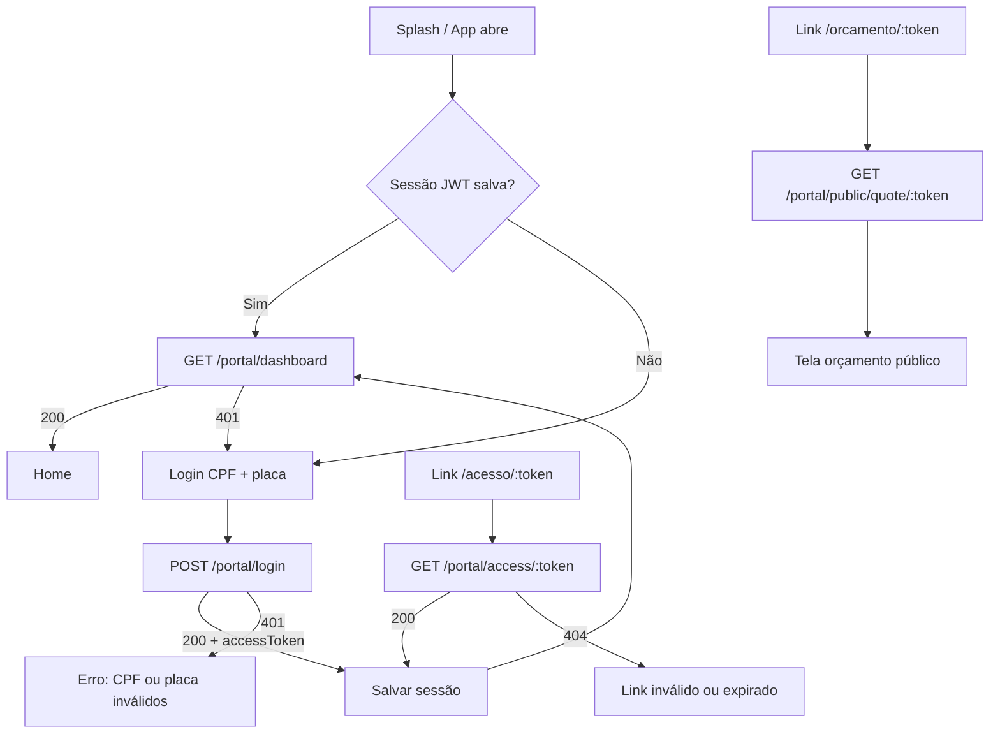
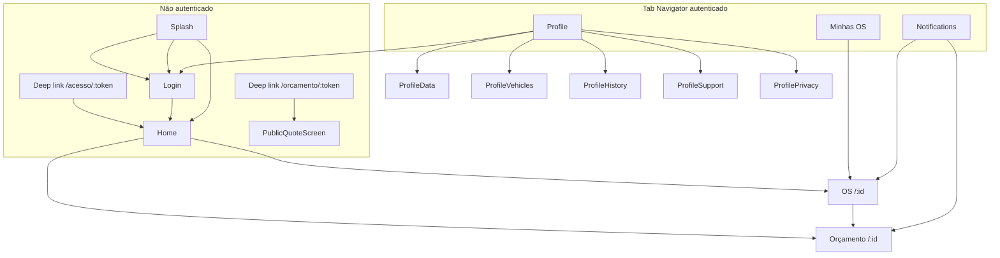

# CLIENT_PORTAL_APP_BLUEPRINT

Blueprint técnico para o aplicativo mobile **Portal do Cliente** (`portal-cliente-app/`), derivado do portal web existente em `apps/portal/` e da API NestJS em `apps/api/`.

**Data da análise:** 21/06/2026  
**Escopo deste documento:** análise e planejamento — **sem implementação**.

---

## 1. Resumo do Portal do Cliente atual

O Portal do Cliente é um **PWA React** (Vite + TypeScript + Tailwind + Zustand) rodando na porta **3001**, separado do ERP (`app/`). Ele permite que o cliente final acompanhe ordens de serviço, orçamentos, fotos, status e notificações do veículo autenticado.

**Autenticação:** CPF + placa do veículo → JWT Bearer com validade de **30 dias**, escopado a um `vehicleId` (e `customerId` + `organizationId`).

**Fluxos alternativos de acesso:**
- Link mágico de portal: `GET /api/portal/access/:token` (token `PortalAccessToken`, expira em ~90 dias)
- Orçamento público sem login: `GET /api/portal/public/quote/:token` (token `QuoteAccessToken`)

**Arquitetura de dados:**
```
apps/portal (PWA)  →  /api/portal/*  →  PortalService  →  Prisma/PostgreSQL
```

O app mobile futuro deve seguir **exatamente o mesmo caminho** — sem acesso direto ao Supabase.

**Características relevantes:**
- Single-tenant por deploy (uma organização por instância)
- Polling a cada 30s para dashboard e notificações
- Push Web (VAPID) no PWA; push nativo via FCM já preparado na API
- Multi-veículo: cliente pode trocar veículo e receber novo JWT
- Aprovação/recusa de orçamento com suporte a **complementos** (linhas parciais)
- Branding dinâmico da organização (cores, logo, mensagem de boas-vindas)

---

## 2. Estrutura encontrada em `apps/portal/`

```
apps/portal/
├── public/                    # Assets estáticos, manifest PWA, push-sw.js
├── src/
│   ├── App.tsx                # Rotas principais
│   ├── main.tsx
│   ├── index.css              # Tokens CSS do tema portal
│   ├── components/
│   │   ├── BrandingBootstrap.tsx
│   │   ├── BrandHeader.tsx / BrandLogo.tsx / BrandTagline.tsx
│   │   ├── StatusBadge.tsx
│   │   └── portal/
│   │       ├── PortalAppLayout.tsx      # Shell autenticado + header + bottom nav
│   │       ├── PortalBottomNav.tsx
│   │       ├── PortalPolling.tsx        # Refresh 30s
│   │       ├── PortalPushBanner.tsx     # Web Push (VAPID)
│   │       ├── PortalInstallBanner.tsx  # PWA install
│   │       ├── RequireAuth.tsx
│   │       ├── VehicleCard.tsx
│   │       ├── QuoteActionCard.tsx
│   │       ├── QuoteDetailContent.tsx
│   │       ├── QuoteSheetLayout.tsx
│   │       ├── PortalPhotosTab.tsx
│   │       ├── PortalChecklistSection.tsx  # Existe mas NÃO é usada nas páginas atuais
│   │       ├── EmptyState.tsx
│   │       ├── LicensePlate.tsx
│   │       ├── QuickServiceGrid.tsx
│   │       ├── MotoBackground.tsx
│   │       └── ThemeToggle.tsx
│   ├── pages/
│   │   ├── PortalSplashPage.tsx
│   │   ├── PortalLoginPage.tsx
│   │   ├── PortalAccessPage.tsx         # Deep link /acesso/:token
│   │   ├── PortalHomePage.tsx
│   │   ├── PortalOrdersPage.tsx
│   │   ├── PortalServiceOrderPage.tsx
│   │   ├── PortalQuotePage.tsx
│   │   ├── PortalNotificationsPage.tsx
│   │   ├── PortalProfilePage.tsx
│   │   ├── PublicQuotePage.tsx          # /orcamento/:token (sem auth)
│   │   └── profile/
│   │       ├── PortalProfileDataPage.tsx
│   │       ├── PortalProfileVehiclesPage.tsx
│   │       ├── PortalProfileHistoryPage.tsx
│   │       ├── PortalProfileSupportPage.tsx
│   │       └── PortalProfilePrivacyPage.tsx
│   ├── stores/
│   │   ├── portalStore.ts     # Sessão, dashboard, notificações, veículos (Zustand persist)
│   │   └── brandingStore.ts
│   ├── hooks/
│   │   ├── usePortalTheme.ts
│   │   ├── usePwaInstall.ts
│   │   └── useAutoPwaInstallPrompt.ts
│   ├── lib/
│   │   ├── api.ts             # Cliente HTTP + tipos TypeScript
│   │   ├── http.ts            # fetch com timeout 15s
│   │   ├── routes.ts
│   │   ├── quote-lines.ts     # Lógica de orçamento/complemento
│   │   ├── portal-status.ts   # Filtros de status OS
│   │   ├── service-order-status.ts
│   │   ├── format.ts
│   │   ├── whatsapp.ts
│   │   ├── branding.ts
│   │   ├── checklist.ts
│   │   ├── mediaUrl.ts / assetUrl.ts / mediaTypes.ts
│   │   └── pushSubscribe.ts   # Web Push
│   └── pwa/
│       ├── install.ts
│       └── register.ts
├── package.json
├── vite.config.ts             # PWA plugin, proxy /api → :4000
├── tailwind.config.js
├── Dockerfile / nginx.conf / vercel.json
└── .env.example
```

**Stack do portal web:**
| Camada | Tecnologia |
|--------|------------|
| UI | React 19, Tailwind CSS 3 |
| Roteamento | react-router 7 |
| Estado | Zustand + persist (localStorage) |
| HTTP | fetch nativo com timeout |
| PWA | vite-plugin-pwa + service worker |
| Ícones | lucide-react |

---

## 3. Telas existentes no portal

| Rota | Componente | Auth | Descrição |
|------|------------|------|-----------|
| `/splash` | `PortalSplashPage` | Não | Splash animada; redireciona para home ou login |
| `/login` | `PortalLoginPage` | Não | Formulário CPF + placa |
| `/acesso/:token` | `PortalAccessPage` | Não → Sim | Login por link mágico |
| `/orcamento/:token` | `PublicQuotePage` | Não | Orçamento público (aprovar/recusar sem sessão) |
| `/` | `PortalHomePage` | Sim | Home: veículo, OS ativa, orçamentos pendentes, atalhos |
| `/os` | `PortalOrdersPage` | Sim | Lista de OS com abas (Todas / Em andamento / Finalizadas) |
| `/os/:id` | `PortalServiceOrderPage` | Sim | Detalhe OS: resumo, fotos, timeline, orçamentos |
| `/orcamentos/:id` | `PortalQuotePage` | Sim | Detalhe orçamento com aprovação/recusa |
| `/notificacoes` | `PortalNotificationsPage` | Sim | Inbox de notificações |
| `/perfil` | `PortalProfilePage` | Sim | Hub de perfil e menu |
| `/perfil/dados` | `PortalProfileDataPage` | Sim | Dados do cliente (somente leitura) |
| `/perfil/veiculos` | `PortalProfileVehiclesPage` | Sim | Lista veículos + troca de veículo ativo |
| `/perfil/historico` | `PortalProfileHistoryPage` | Sim | OS finalizadas |
| `/perfil/suporte` | `PortalProfileSupportPage` | Sim | WhatsApp, telefone, endereço, horário |
| `/perfil/privacidade` | `PortalProfilePrivacyPage` | Sim | Texto estático de privacidade |

**Navegação autenticada:** bottom tab bar com 4 abas — Início, OS, Notificações, Perfil.

---

## 4. Fluxo de acesso/login



**Detalhes implementados:**

1. **Login CPF + placa** (`PortalLoginPage` → `portalStore.login`):
   - CPF mascarado no input (11 dígitos)
   - Placa normalizada: uppercase, apenas A-Z0-9, máx. 7 caracteres
   - POST `{ cpf, plate }` → recebe `{ accessToken, organizationName, customerName, plate }`
   - Após login: `refresh()` (dashboard) + `loadNotifications()`

2. **Persistência de sessão:**
   - Zustand persist em `localStorage` (`oficina-beto-portal`)
   - Persiste: `session` + `dashboard` (cache)
   - Logout: limpa tudo localmente (sem endpoint de logout na API)

3. **Guard de rotas:**
   - `RequireAuth` redireciona para `/login` se não houver `session.accessToken`

4. **Link mágico de portal:**
   - Gerado pelo ERP via `PortalService.createPortalAccessLink()` (90 dias)
   - Path: `/acesso/{token}` → troca por JWT de sessão

5. **Orçamento público:**
   - Path: `/orcamento/{token}` — **não cria sessão completa**
   - Permite ver e aprovar/recusar apenas aquele orçamento

---

## 5. Regras de CPF + placa

**Backend** (`PortalService.login`):

1. Normaliza CPF: remove não-dígitos
2. Normaliza placa: uppercase, remove caracteres especiais
3. Busca até 5 veículos com placa correspondente (com ou sem hífen, case-insensitive)
4. Filtra candidatos onde `normalizeDigits(customer.document) === cpfDigits`
5. Se nenhum match: `401 Unauthorized — CPF ou placa inválidos`
6. Se match: emite JWT com `{ portal: true, organizationId, customerId, vehicleId }`

**Regras de negócio:**
- A placa **deve** estar cadastrada no sistema
- O CPF **deve** pertencer ao `customer` dono do veículo
- O par CPF+placa define **qual veículo** entra na sessão (o mais recentemente atualizado entre os candidatos)
- Não há validação de formato de CPF (dígitos verificadores) — apenas igualdade de dígitos
- DTO exige `cpf` min 11 chars e `plate` min 6 chars

**Troca de veículo** (após login):
- `POST /portal/switch-vehicle { vehicleId }` — só permite veículos do mesmo `customerId` + `organizationId`
- Retorna **novo JWT** com outro `vehicleId`

---

## 6. Dados liberados ao cliente

| Domínio | Campos visíveis |
|---------|-----------------|
| **Organização** | name, phone, email, portalWelcome, address (filial principal), logoUrl, primaryColor, accentColor |
| **Cliente** | name, phone, whatsapp (document parcialmente mascarado na UI; exposto na API em `/portal/me` e detalhe OS) |
| **Veículo** | id, plate, brand, model, year, color, currentKm, vehicleKind |
| **OS** | id, number, status, statusLabel, totalAmount, complaint, customerVisibleNotes, estimatedAt, entryKm, createdAt, updatedAt |
| **Itens OS** | id, description, itemType, quantity, unitPrice (retornados pela API; **não exibidos diretamente na UI web atual** — aparecem via linhas de orçamento) |
| **Timeline** | fromStatus, toStatus, labels PT, notes, userName (nome do funcionário), createdAt |
| **Checklist** | category, label, result (OK/ATTENTION/DAMAGED/NA), notes, foto por item |
| **Fotos/Mídia** | Galeria ordenada: fotos de checklist + anexos `visibleToCustomer` ou categoria `checklist-*` |
| **Anexos** | id, fileName, mimeType, url (assinada), category, createdAt — somente `visibleToCustomer: true` ou checklist |
| **Orçamentos** | id, number, status, amount, lines (description, lineType, quantity, unitPrice, discount, approved), isSupplement, canRespond, photos, serviceOrder resumida |
| **Notificações** | id, type, title, body, read, serviceOrderId, quoteId, createdAt (escopo: vehicleId da sessão) |
| **Branding público** | name, tradeName, logoUrl, primaryColor, accentColor (sem auth) |

**Limites de listagem:**
- Dashboard: até **20** OS por veículo
- Notificações: até **50** por veículo
- Orçamentos: todos não-DRAFT do veículo

---

## 7. Dados bloqueados ao cliente

O portal **não expõe** (por design na API ou por não inclusão no payload):

| Dado interno | Motivo |
|--------------|--------|
| Margem de lucro, custo de peças, markup | Não presente nos DTOs do portal |
| Notas internas da OS (`internalNotes` etc.) | Apenas `customerVisibleNotes` |
| Diagnóstico técnico (`diagnosis`) | Retornado pela API no detalhe OS, mas **não renderizado** na UI web |
| Anexos com `visibleToCustomer: false` (exceto checklist) | Filtrados no `getServiceOrderForPortal` |
| Orçamentos em status `DRAFT` | Excluídos de `listQuotes` |
| OS deletadas (soft delete) | Filtro `notDeleted` |
| OS de outros veículos/clientes | Filtro `vehicleId` do JWT |
| Dados de funcionários além do nome na timeline | Sem email, roles, etc. |
| Dados financeiros da oficina | Sem faturamento, DRE, etc. |
| Outros clientes da organização | Escopo restrito ao `customerId` do veículo |
| Tokens de acesso de terceiros | Apenas o próprio token na URL pública |
| Edição de cadastro | UI informa "entre em contato com a oficina" |

---

## 8. Endpoints existentes usados pelo portal

Base URL: `{API_URL}/api`

### Públicos (sem JWT)

| Método | Endpoint | Uso no portal |
|--------|----------|---------------|
| GET | `/auth/branding` | Logo/cores antes do login (`BrandingBootstrap`) |
| POST | `/portal/login` | Login CPF + placa |
| GET | `/portal/access/:token` | Link mágico `/acesso/:token` |
| GET | `/portal/public/quote/:token` | Orçamento público |
| PATCH | `/portal/public/quote/:token/approve` | Aprovar orçamento público |
| PATCH | `/portal/public/quote/:token/reject` | Recusar orçamento público |
| GET | `/portal/push/vapid-public-key` | Web Push (PWA) |

### Autenticados (Bearer JWT portal)

| Método | Endpoint | Uso no portal |
|--------|----------|---------------|
| GET | `/portal/dashboard` | Home, listas, cache principal |
| GET | `/portal/service-orders/:id` | Detalhe da OS |
| GET | `/portal/quotes` | Lista orçamentos (não chamado diretamente — vem no dashboard) |
| GET | `/portal/quotes/:id` | Detalhe orçamento |
| PATCH | `/portal/quotes/:id/approve` | Aprovar orçamento |
| PATCH | `/portal/quotes/:id/reject` | Recusar orçamento |
| GET | `/portal/notifications` | Lista notificações |
| PATCH | `/portal/notifications/:id/read` | Marcar uma como lida |
| PATCH | `/portal/notifications/read-all` | Marcar todas como lidas |
| GET | `/portal/vehicles` | Lista veículos do cliente |
| POST | `/portal/switch-vehicle` | Trocar veículo ativo |
| POST | `/portal/push/subscribe` | Web Push subscription |

### Existem na API mas NÃO usados pelo portal web

| Método | Endpoint | Observação |
|--------|----------|------------|
| GET | `/portal/me` | Definido em `api.ts` mas **nunca chamado** — dashboard substitui |
| POST | `/portal/push/fcm-register` | Para app Android/iOS nativo |
| GET | `/portal/push/status` | Verifica se FCM está registrado |

---

## 9. Payloads encontrados

### POST `/portal/login`

**Request:**
```json
{
  "cpf": "123.456.789-00",
  "plate": "ABC1D23"
}
```

**Response (200):**
```json
{
  "accessToken": "eyJhbG...",
  "organizationName": "OFICINA DO BETO",
  "customerName": "João Silva",
  "plate": "ABC-1D23"
}
```

**Erro (401):** `{ "message": "CPF ou placa inválidos", "statusCode": 401 }`

---

### GET `/portal/dashboard`

**Headers:** `Authorization: Bearer {accessToken}`

**Response (200):** ver interface `PortalDashboard` em `apps/portal/src/lib/api.ts`:
- `organization`, `customer`, `vehicle`
- `serviceOrders[]` (até 20)
- `quotes[]` (orçamentos não-DRAFT)
- `attachments[]` (da OS mais recente, `visibleToCustomer`)

---

### GET `/portal/service-orders/:id`

**Response (200):** ver `PortalServiceOrderDetail`:
- Dados da OS + `items[]`, `timeline[]`, `checklistItems[]`, `photos[]`, `attachments[]`, `quotes[]`
- `organization.phone`, `customer.whatsapp`, `customer.phone`

**Erro (404):** OS não encontrada ou não pertence ao veículo da sessão

---

### GET `/portal/quotes/:id`

**Response (200):** `PortalQuoteRow` + `photos[]`

Campos importantes do orçamento:
```json
{
  "id": "cuid",
  "number": 1,
  "status": "PENDING",
  "amount": 1500.00,
  "canRespond": true,
  "isSupplement": false,
  "pendingLineCount": 3,
  "lines": [
    {
      "id": "line-id",
      "description": "Troca de óleo",
      "lineType": "SERVICE",
      "quantity": 1,
      "unitPrice": 80.00,
      "discount": 0,
      "approved": null,
      "sortOrder": 0
    }
  ],
  "serviceOrder": { "id": "...", "number": 42, "status": "AWAITING_APPROVAL" }
}
```

---

### PATCH `/portal/quotes/:id/approve`

**Request (opcional — aprovação por linha):**
```json
{
  "lines": [
    { "lineId": "cuid", "approved": true }
  ],
  "comment": "Pode executar"
}
```

Se `lines` omitido ou vazio: API aprova **todas as linhas pendentes** (`approved: null` → `true`).

**Response (200):** orçamento atualizado (`PortalQuoteRow`)

**Erro (400):** `"Responda todos os itens novos antes de enviar"` — complemento com linhas pendentes não respondidas

---

### PATCH `/portal/quotes/:id/reject`

**Request (opcional):**
```json
{ "comment": "Valor alto" }
```

**Comportamento:**
- Orçamento novo: status → `REJECTED`, OS → `AWAITING_QUOTE`
- Complemento (linhas já aprovadas + novas pendentes): recusa só itens novos, mantém aprovados, OS → `IN_PROGRESS`

---

### POST `/portal/switch-vehicle`

**Request:**
```json
{ "vehicleId": "cuid" }
```

**Response (200):** mesmo formato do login (novo `accessToken`)

---

### GET `/portal/notifications?unreadOnly=true`

**Response (200):**
```json
[
  {
    "id": "cuid",
    "type": "orcamento",
    "title": "Novo orçamento disponível",
    "body": "OS #42 aguarda sua aprovação",
    "read": false,
    "serviceOrderId": "cuid",
    "quoteId": "cuid",
    "createdAt": "2026-06-21T12:00:00.000Z"
  }
]
```

**Tipos de notificação gerados pelo backend:** `orcamento`, `status`, `finalizacao`, `anexo` (e outros via `portalNotificationType`)

---

### POST `/portal/push/fcm-register` (API only — para mobile)

**Request:**
```json
{
  "token": "fcm-device-token",
  "platform": "android"
}
```

**Response:** `{ "ok": true }`

---

### GET `/portal/access/:token` e GET `/portal/public/quote/:token`

Ver seções de fluxo alternativo acima. Tokens expiram conforme `expiresAt` no banco.

---

## 10. Endpoints que faltam para o app mobile

A API já cobre **quase todo o escopo funcional**. Gaps reais:

| Prioridade | Gap | Descrição | Workaround no app |
|------------|-----|-----------|-------------------|
| **Baixa** | Refresh token / renovação | JWT expira em 30d; sem endpoint de refresh | Re-login CPF+placa ou silent re-auth se 401 |
| **Baixa** | Logout server-side | Não invalida JWT no servidor | Limpar storage local (como o PWA) |
| **Baixa** | Health check | Sem `/portal/health` ou `/api/health` dedicado ao app | Usar `GET /auth/branding` como ping |
| **Baixa** | Config do app | Sem endpoint de versão mínima, feature flags | Hardcode + branding público |
| **Média** | Push iOS (APNs) | API tem FCM; iOS pode precisar APNs via Firebase | Usar FCM SDK que abstrai APNs |
| **Média** | Registro FCM no cliente | Endpoint existe mas portal web não usa | App deve chamar `POST /portal/push/fcm-register` |
| **Média** | Status push | `GET /portal/push/status` não integrado no PWA | App pode usar para UX de "notificações ativas" |
| **Opcional** | Aprovação linha a linha na UI | API suporta; PWA só aprova tudo ou recusa tudo | App pode implementar UI granular sem mudar API |
| **Opcional** | Exibir `diagnosis` | API já retorna; UI web omite | Decidir com produto se mobile deve mostrar |
| **Opcional** | Checklist dedicado | API retorna `checklistItems`; componente web existe mas não usado | Reutilizar dados no mobile |
| **Opcional** | Rate limiting no login | Não implementado na API | Mitigar no app (debounce, captcha futuro) |

**Conclusão:** o app mobile **pode ser construído hoje** consumindo os endpoints existentes. Não é necessário alterar a API para o MVP — exceto configurar Firebase/APNs no deploy.

---

## 11. Telas necessárias no app mobile

Mapeamento das 16 telas solicitadas:

| # | Tela | Existe no portal? | Observação |
|---|------|-------------------|------------|
| 1 | Splash | ✅ `PortalSplashPage` | Animação + checagem de sessão |
| 2 | Login CPF + placa | ✅ `PortalLoginPage` | Formulário completo |
| 3 | Home do cliente | ✅ `PortalHomePage` | Saudação, veículo, OS ativa, orçamentos pendentes |
| 4 | Meu veículo | ⚠️ Parcial | `VehicleCard` na home + `PortalProfileVehiclesPage` para multi-veículo |
| 5 | OS em andamento | ✅ `PortalOrdersPage` (aba) + card na home | Filtro `isInProgress` |
| 6 | Detalhes da OS | ✅ `PortalServiceOrderPage` | Abas Resumo / Fotos |
| 7 | Status da OS | ✅ Integrado no detalhe | Badge + timeline + `statusLabel` |
| 8 | Orçamento | ✅ `PortalQuotePage` | Abas Orçamento / Fotos |
| 9 | Aprovar orçamento | ✅ `QuoteDetailContent` + `QuoteActionCard` | Botão verde; chama PATCH approve |
| 10 | Recusar orçamento | ✅ Idem | Confirm dialog + PATCH reject |
| 11 | Histórico de serviços | ✅ `PortalProfileHistoryPage` | OS com status FINISHED/DELIVERED/CANCELLED |
| 12 | Notificações | ✅ `PortalNotificationsPage` | Inbox com deep link para OS/orçamento |
| 13 | Perfil básico | ✅ `PortalProfilePage` + `PortalProfileDataPage` | Somente leitura |
| 14 | Suporte / WhatsApp | ✅ `PortalProfileSupportPage` | Links wa.me e tel: |
| 15 | Tela sem OS encontrada | ⚠️ Parcial | `EmptyState` na home e listas — **sem tela dedicada** |
| 16 | Tela sem internet | ❌ Não existe | Apenas timeout de 15s com mensagem genérica |

**Telas extras no portal (replicar no app):**
- Acesso por link mágico (`/acesso/:token`)
- Orçamento público (`/orcamento/:token`)
- Política de privacidade
- Troca de veículo

---

## 12. Navegação sugerida



**Padrões do portal a manter:**
- Bottom navigation com 4 abas
- Esconder tab bar em detalhes de OS e orçamento
- Badge vermelho em Notificações (contagem `!read`)
- Botão voltar em subpáginas de perfil

**Deep links nativos sugeridos:**
- `oficinadobeto://acesso/{token}`
- `oficinadobeto://orcamento/{token}`
- `oficinadobeto://os/{id}`
- `oficinadobeto://orcamentos/{id}`

---

## 13. Regras de segurança

### Implementado na API

| Regra | Status |
|-------|--------|
| Cliente só vê dados do próprio CPF | ✅ Login exige match CPF ↔ customer do veículo |
| Placa vinculada ao cliente | ✅ `vehicle.customerId` validado no login |
| OS vinculada ao veículo da sessão | ✅ Queries filtram `vehicleId` do JWT |
| JWT escopo portal | ✅ Payload `{ portal: true, organizationId, customerId, vehicleId }` |
| Validação do veículo a cada request | ✅ `PortalJwtStrategy` revalida veículo no banco |
| Expiração de sessão | ✅ JWT `expiresIn: '30d'`, `ignoreExpiration: false` |
| Anexos restritos | ✅ `visibleToCustomer` + checklist |
| Orçamento público por token | ✅ `QuoteAccessToken` com `expiresAt` |
| Link de acesso por token | ✅ `PortalAccessToken` com `expiresAt` |
| Troca de veículo segura | ✅ Só veículos do mesmo `customerId` |
| Aprovação exige JWT ou token de orçamento | ✅ `PortalJwtGuard` ou `QuoteAccessToken` |

### Pontos de atenção (fragilidades)

| Risco | Severidade | Detalhe |
|-------|------------|---------|
| **Auth por CPF + placa** | 🔴 Alta | Conhecimento público (placa visível no carro) + CPF parcialmente adivinhável. Não é MFA. Qualquer pessoa com CPF+placa corretos acessa OS, fotos e orçamentos. |
| **Sem rate limiting no login** | 🟠 Média | Permite tentativa e erro de combinações CPF/placa |
| **JWT longo (30 dias)** | 🟠 Média | Token roubado permanece válido; sem revogação server-side |
| **CPF exposto na API** | 🟡 Baixa | `/portal/me` e detalhe OS retornam `customer.document`; UI mascara mas API entrega |
| **Mensagem de erro genérica** | 🟢 Positivo | "CPF ou placa inválidos" — não revela qual campo falhou |
| **Sem logout server-side** | 🟡 Baixa | JWT continua válido após "sair" |
| **Orçamento público por URL** | 🟠 Média | Quem tem o link pode aprovar/recusar até expirar |
| **Timeline expõe nome do funcionário** | 🟡 Baixa | `userName` visível ao cliente |

**Recomendações futuras (fora do escopo MVP):**
- Rate limit em `POST /portal/login`
- OTP via WhatsApp/SMS como segundo fator
- Refresh token com rotação
- Revogação de JWT / blacklist
- Mascarar CPF também na API

---

## 14. Regras de aprovação/recusa de orçamento

### Quando o cliente pode responder

```typescript
// apps/portal/src/lib/quote-lines.ts
canRespond = status !== APPROVED|REJECTED|DRAFT
           && pendingLines.length > 0
           && (canRespond ?? status === 'PENDING')
```

### Aprovação

1. Portal envia `buildApprovePayload`: todas as linhas com `approved === null` → `approved: true`
2. API (`applyLineApprovals`):
   - Se sem `lines` no body: aprova todas pendentes
   - Se complemento: exige resposta em **todas** linhas novas antes de concluir
3. Resultado:
   - **Aprovação total:** quote → `APPROVED`, OS → `APPROVED` ou `IN_PROGRESS`
   - **Complemento aprovado:** mantém linhas anteriores, OS → `IN_PROGRESS`
   - **Complemento com recusas parciais:** remove itens rejeitados da OS
4. Notifica a **oficina** (não o cliente) via `EventsService`

### Recusa

1. Confirmação no UI: `"Recusar este orçamento? A oficina será notificada."`
2. **Orçamento novo (sem linhas aprovadas):** quote → `REJECTED`, OS → `AWAITING_QUOTE`
3. **Complemento:** recusa linhas pendentes, remove itens da OS, quote permanece `APPROVED` com valor das linhas aprovadas, OS → `IN_PROGRESS`
4. Comentário opcional via `customerComment`

### Orçamento público

Mesma lógica de approve/reject, autenticado pelo `QuoteAccessToken` na URL.

---

## 15. Regras de exibição de status da OS

### Status e labels (backend `STATUS_PT` + frontend `osStatusLabel`)

| Status API | Label PT |
|------------|----------|
| RECEIVED | Recebido |
| DIAGNOSIS | Em diagnóstico |
| AWAITING_QUOTE | Aguardando orçamento |
| AWAITING_APPROVAL | Aguardando aprovação |
| APPROVED | Aprovado |
| IN_PROGRESS | Em execução |
| AWAITING_PART | Aguardando peça |
| PAUSED | Pausado |
| AWAITING_PAYMENT | Aguardando pagamento |
| FINISHED | Finalizado |
| DELIVERED | Entregue |
| CANCELLED | Cancelado |

### Classificações no cliente

```typescript
// Finalizados: FINISHED, DELIVERED, CANCELLED
// Em andamento: todos os demais
// OS ativa na home: primeira OS com isInProgress()
```

### Timeline

- Fonte: `serviceOrderStatusHistory` ordenado por `createdAt`
- Se vazio: evento sintético "OS aberta" com status atual
- Exibe: `toLabel`, data/hora, `notes` (inclui motivos de mudança)

### Variantes visuais

Mapeamento em `service-order-status.ts` → `StatusBadge` (pendente, execução, aguardando aprovação, confirmado, etc.)

---

## 16. Regras de histórico

- **Fonte de dados:** `dashboard.serviceOrders` (mesmo endpoint, sem API dedicada)
- **Filtro:** `isFinished(status)` → FINISHED, DELIVERED, CANCELLED
- **Limite:** até 20 OS (as mais recentes por `updatedAt`)
- **UI:** lista clicável → detalhe da OS
- **Não inclui:** histórico de orçamentos separado (fica dentro de cada OS)

---

## 17. Regras de notificações futuras

### Backend (já implementado)

**Geração automática** via `EventsService.emitCustomer` / `emitOffice` com `customerPush: true`:
- Novo orçamento (`quotes.service` → tipo `orcamento`)
- Mudança de status OS (`service-orders.service` → `status`, `finalizacao`)
- Novo anexo visível (`attachments.service` → `anexo`)

**Persistência:** tabela `portal_notifications` (escopo `vehicleId`)

**Entrega push:**
1. Grava inbox (`portal_notifications`)
2. Envia FCM (`fcm_tokens` por `vehicleId`)
3. Envia Web Push (`push_subscriptions` — PWA)

### Portal web

- Polling 30s + carregamento ao abrir
- Banner para ativar Web Push (VAPID)
- Tap na notificação → navega para orçamento ou OS
- Marcar lida individual ou todas

### App mobile (a implementar)

| Recurso | Endpoint | Observação |
|---------|----------|------------|
| Registrar FCM | `POST /portal/push/fcm-register` | Obrigatório para push nativo |
| Verificar registro | `GET /portal/push/status` | UX opcional |
| Inbox | `GET /portal/notifications` | Igual ao PWA |
| Marcar lida | `PATCH .../read` e `.../read-all` | Igual ao PWA |
| Push em foreground/background | Firebase SDK | Payload: `{ title, body, url }` |
| Deep link do push | Parsear `url` do payload | Ex: `/os/{id}`, `/orcamentos/{id}` |

**iOS:** configurar APNs no Firebase; endpoint FCM permanece o mesmo.

---

## 18. Estrutura sugerida para `portal-cliente-app/`

```
portal-cliente-app/
├── app/                          # Expo Router ou React Navigation screens
│   ├── (auth)/
│   │   ├── splash.tsx
│   │   ├── login.tsx
│   │   └── access/[token].tsx
│   ├── (tabs)/
│   │   ├── index.tsx             # Home
│   │   ├── orders.tsx
│   │   ├── notifications.tsx
│   │   └── profile.tsx
│   ├── os/[id].tsx
│   ├── orcamentos/[id].tsx
│   ├── orcamento-publico/[token].tsx
│   └── profile/
│       ├── dados.tsx
│       ├── veiculos.tsx
│       ├── historico.tsx
│       ├── suporte.tsx
│       └── privacidade.tsx
├── src/
│   ├── api/
│   │   ├── client.ts             # Port de apps/portal/src/lib/http.ts
│   │   ├── portal.ts             # Port de apps/portal/src/lib/api.ts
│   │   └── types.ts              # Tipos compartilhados (copiar de api.ts)
│   ├── stores/
│   │   └── session.ts            # Port de portalStore.ts (AsyncStorage)
│   ├── lib/
│   │   ├── quote-lines.ts        # Copiar do portal
│   │   ├── portal-status.ts
│   │   ├── service-order-status.ts
│   │   ├── format.ts
│   │   └── whatsapp.ts
│   ├── components/
│   │   ├── VehicleCard.tsx
│   │   ├── QuoteActionCard.tsx
│   │   ├── QuoteDetailContent.tsx
│   │   ├── StatusBadge.tsx
│   │   ├── EmptyState.tsx
│   │   └── OfflineBanner.tsx     # Novo — não existe no PWA
│   ├── hooks/
│   │   ├── useDashboard.ts
│   │   ├── usePolling.ts
│   │   └── useNetworkStatus.ts
│   └── notifications/
│       ├── fcm.ts
│       └── handlers.ts
├── app.json / app.config.ts
├── package.json
├── tsconfig.json
└── .env.example                  # EXPO_PUBLIC_API_URL
```

**Arquivos do portal para usar como referência direta (copiar/adaptar):**
- `apps/portal/src/lib/api.ts` — tipos e endpoints
- `apps/portal/src/lib/quote-lines.ts` — lógica de orçamento
- `apps/portal/src/lib/portal-status.ts` — filtros
- `apps/portal/src/lib/service-order-status.ts` — labels
- `apps/portal/src/stores/portalStore.ts` — fluxo de sessão
- `apps/portal/src/components/portal/QuoteDetailContent.tsx` — UI de orçamento
- `apps/portal/src/components/portal/QuoteActionCard.tsx`
- `apps/portal/src/pages/*` — comportamento de cada tela

---

## 19. Stack recomendada

| Camada | Recomendação | Justificativa |
|--------|--------------|---------------|
| Framework | **React Native + Expo** | Mesma linguagem do portal (TypeScript/React); reuso de tipos e lógica de negócio |
| Navegação | **Expo Router** | File-based routing similar ao react-router do portal |
| Estado | **Zustand** + AsyncStorage | Paridade com `portalStore.ts` |
| HTTP | **fetch** + timeout | Paridade com `http.ts` |
| Push | **@react-native-firebase/messaging** ou **expo-notifications** + FCM | API já tem `fcm-register` |
| Storage | **expo-secure-store** para JWT | Mais seguro que AsyncStorage puro |
| UI | **NativeWind** (Tailwind RN) ou **Tamagui** | Aproximar visual do portal Tailwind |
| Deep links | **expo-linking** | `/acesso/:token`, `/orcamento/:token` |
| Build | **EAS Build** | Android + iOS na mesma pipeline |

**Alternativa:** Kotlin Compose (Android) + SwiftUI (iOS) — já existe `docs/PORTAL-ANDROID-MAPEAMENTO.md` e pasta `APLICATIVO OFICINA/` (app interno da oficina, não portal). Usar se a equipe for 100% nativa; porém duplica lógica entre plataformas.

**Não usar:**
- Acesso direto ao Supabase
- Dados mockados ou telas demo
- BaaS paralelo

---

## 20. Plano de implementação em fases

### Fase 1 — MVP (paridade com PWA)

**Objetivo:** app funcional consumindo API real.

- [ ] Scaffold `portal-cliente-app/` (Expo)
- [ ] Cliente API (copiar tipos e endpoints de `apps/portal/src/lib/api.ts`)
- [ ] Store de sessão com SecureStore
- [ ] Splash + Login CPF/placa
- [ ] Home (dashboard)
- [ ] Lista e detalhe de OS
- [ ] Detalhe e aprovação/recusa de orçamento
- [ ] Perfil básico + suporte WhatsApp
- [ ] Tratamento de erro de rede (tela/banner offline)
- [ ] Empty states (sem OS)

**Entregável:** APK/IPA interno para testes com API de staging/produção.

### Fase 2 — Notificações e multi-veículo

- [ ] Inbox de notificações
- [ ] FCM register + handlers de push
- [ ] Deep links (acesso, orçamento, OS)
- [ ] Tela meus veículos + switch vehicle
- [ ] Histórico de serviços
- [ ] Polling em background (ou refresh on focus)

### Fase 3 — Polish e paridade total

- [ ] Galeria de fotos com zoom
- [ ] Orçamento público por link
- [ ] Link mágico `/acesso/:token`
- [ ] Branding dinâmico (cores/logo da API)
- [ ] Tema claro/escuro
- [ ] Política de privacidade
- [ ] Aprovação linha a linha (UI granular — API já suporta)

### Fase 4 — Produção

- [ ] Ícones e splash nativos por organização
- [ ] Publicação Play Store / App Store
- [ ] Monitoramento (Sentry/Crashlytics)
- [ ] Testes E2E dos fluxos críticos (login, aprovar orçamento)

---

## Apêndice A — Componentes reaproveitáveis como referência

| Componente portal | Uso no mobile |
|-------------------|---------------|
| `QuoteDetailContent` | Tela de orçamento — lógica de complemento, totais, botões |
| `QuoteActionCard` | Card na home para orçamentos pendentes |
| `VehicleCard` | Card de veículo na home |
| `PortalPhotosTab` | Galeria de fotos da OS/orçamento |
| `StatusBadge` + `service-order-status.ts` | Badges de status |
| `EmptyState` | Estados vazios padronizados |
| `LicensePlate` | Renderização de placa BR |
| `quote-lines.ts` | Toda lógica de aprovação |
| `portalStore.ts` | Fluxo auth/refresh/notifications |
| `PortalPolling` | Estratégia de refresh 30s |

---

## Apêndice B — Variáveis de ambiente

**Portal web** (`apps/portal/.env.example`):
```
VITE_API_URL=
VITE_DASHBOARD_URL=http://localhost:3000
VITE_APP_NAME=OFICINA DO BETO
VITE_CONTACT_WHATSAPP=
```

**App mobile sugerido:**
```
EXPO_PUBLIC_API_URL=https://api.oficinadobeto.com.br
EXPO_PUBLIC_APP_NAME=OFICINA DO BETO
```

Em dev, o portal usa proxy Vite `/api` → `localhost:4000`. O app deve apontar para a URL completa da API NestJS.

---

## Apêndice C — Próximo prompt recomendado

Use este prompt para iniciar a implementação:

```
Com base no CLIENT_PORTAL_APP_BLUEPRINT.md, crie o projeto portal-cliente-app/ usando Expo + TypeScript.

Requisitos:
1. Consumir a API real em /api/portal/* (sem mock, sem Supabase direto)
2. Copiar tipos e lógica de apps/portal/src/lib/api.ts, quote-lines.ts, portal-status.ts, service-order-status.ts
3. Implementar Fase 1 do blueprint: splash, login CPF+placa, home, OS lista/detalhe, orçamento aprovar/recusar, perfil/suporte, offline banner
4. JWT em expo-secure-store; polling 30s como o PWA
5. Manter paridade visual com apps/portal (cores, cards, bottom tabs)
6. Não alterar apps/portal nem apps/api

API URL: [informar URL]
```

---

*Documento gerado por análise estática do código em `apps/portal/` e `apps/api/src/portal/` — sem alterações no repositório.*
