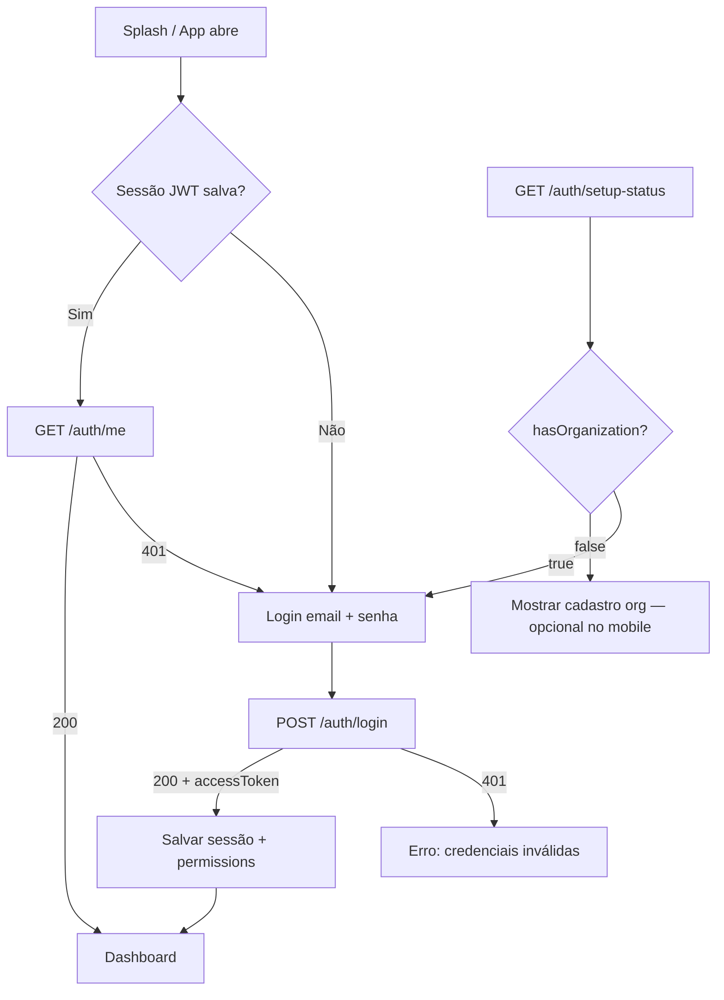
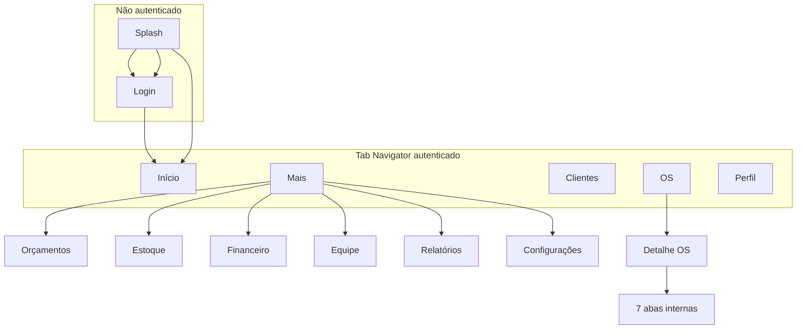

# ERP_ANDROID_APP_BLUEPRINT

Blueprint técnico para o aplicativo mobile **ERP de Gestão** (`APLICATIVO ERP/`), derivado do ERP web existente em `app/` e da API NestJS em `apps/api/`.

**Data da análise:** 21/06/2026  
**Escopo deste documento:** análise e planejamento + prompt completo para implementação no Android Studio — **sem alterações automáticas no repositório**.

---

## 1. Resumo do ERP atual

O ERP é o sistema **completo de gestão da oficina mecânica**: clientes, veículos, ordens de serviço (12 status), orçamentos (incl. complemento), estoque, catálogo de serviços, agenda, compras/fornecedores, financeiro (contas + caixa), equipe/comissões/folha interna, relatórios BI, configurações e admin.

**Autenticação staff:** e-mail + senha → JWT Bearer com validade de **7 dias**, escopado a `organizationId` + `permissions[]`.

**Arquitetura de dados:**

```
app/ (ERP web)  →  /api/*  →  NestJS controllers  →  Prisma/PostgreSQL
```

O app Android futuro deve seguir **exatamente o mesmo caminho** — sem acesso direto ao Supabase.

**Características relevantes:**

- Single-tenant por deploy (uma organização por instância; cadastro em `/cadastro` só na primeira vez)
- Permissões granulares por slug (`dashboard.view`, `service_orders.manage`, etc.)
- `admin.access` passa em tudo (igual API)
- Branding dinâmico da organização (logo, cores) via `/auth/branding`
- Polling de notificações no web (sem push staff nativo consolidado)
- Complemento de orçamento com linhas parciais (`QuoteLine.approved`)
- Upload de anexos OS: multipart local ou prepare/confirm Supabase Storage

**Apps Android irmãos (NÃO confundir):**

| Pasta | Público | API |
|-------|---------|-----|
| `APLICATIVO OFICINA/` | Mecânico/recepção no chão | `/api/*` operacional (~20 rotas) |
| `APLICATIVO COLABORADOR/` | Funcionário (RH) | `/api/colaborador-app/*` |
| `APLICATIVO PORTAL CLIENTE/` | Cliente final | `/api/portal/*` |
| **`APLICATIVO ERP/` (este)** | **Gestão staff (ERP completo)** | **`/api/*` staff JWT** |

---

## 2. Arquitetura do monorepo

```
┌─────────────────┐   ┌─────────────────┐   ┌──────────────────────┐
│  app/ (ERP web) │   │ apps/portal/    │   │ APLICATIVO OFICINA/  │
│  Vite + React   │   │ Portal cliente  │   │ Kotlin + Compose     │
│  porta 3000     │   │ porta 3001      │   │ (operacional chão)   │
└────────┬────────┘   └────────┬────────┘   └──────────┬───────────┘
         │                     │                        │
         └─────────────────────┼────────────────────────┘
                               ▼
                    ┌──────────────────────┐
                    │  apps/api/ (NestJS)  │
                    │  prefixo /api        │
                    └──────────┬───────────┘
                               ▼
                    ┌──────────────────────┐
                    │ packages/database/   │
                    │ Prisma + PostgreSQL  │
                    └──────────────────────┘
```

| Camada | Pasta | Stack |
|--------|-------|-------|
| ERP web | `app/` | React 19, Vite, React Router, TanStack Query, Zustand, Tailwind |
| Portal | `apps/portal/` | React, Vite, PWA |
| API | `apps/api/` | NestJS, Prisma, Passport JWT, bcrypt |
| Banco | `packages/database/` | Prisma 6, PostgreSQL 16 |
| Tipos | `packages/types/` | TypeScript compartilhado |
| App operacional | `APLICATIVO OFICINA/` | Kotlin, Jetpack Compose, Retrofit |
| App colaborador | `APLICATIVO COLABORADOR/` | Kotlin, Jetpack Compose, Retrofit |
| App portal | `APLICATIVO PORTAL CLIENTE/` | Kotlin, Jetpack Compose, Retrofit, FCM |

**Deploy típico:** 3 projetos Vercel (API, ERP, Portal) + 1 Supabase por oficina.

---

## 3. Estrutura encontrada no ERP web (`app/`)

```
app/
├── src/
│   ├── App.tsx                    # Rotas principais
│   ├── components/
│   │   ├── BrandingBootstrap.tsx
│   │   ├── ProtectedRoute.tsx
│   │   └── StatusBadge.tsx
│   ├── layouts/
│   │   ├── AppShell.tsx           # Sidebar + header
│   │   └── TeamLayout.tsx         # Submenu equipe
│   ├── pages/
│   │   ├── auth/                  # LoginPage, RegisterOrganizationPage
│   │   ├── DashboardPage.tsx
│   │   ├── customers/             # CustomersPage, CustomerDetailPage
│   │   ├── vehicles/              # VehiclesPage, VehicleDetailPage
│   │   ├── service-orders/        # ServiceOrdersPage, ServiceOrderDetailPage (7 abas)
│   │   ├── quotes/                # QuotesPage, QuoteDetailPage
│   │   ├── services/              # ServicesPage (catálogo)
│   │   ├── inventory/             # InventoryPage
│   │   ├── agenda/                # AgendaPage
│   │   ├── purchases/             # PurchasesPage (wizard 5 passos)
│   │   ├── suppliers/             # SuppliersPage, SupplierDetailPage
│   │   ├── financial/             # FinancialPage
│   │   ├── reports/               # ReportsPage (BI + export)
│   │   ├── settings/              # SettingsPage
│   │   ├── admin/                 # AdminDashboardPage
│   │   └── team/                  # Employees, JobTitles, Permissions, CommissionRules,
│   │                              # TeamEntries, Payroll, Productivity, Escalas, Ponto, Solicitacoes
│   └── lib/
│       ├── api.ts                 # Cliente HTTP + tipos TypeScript (~2600 linhas)
│       ├── http.ts                # fetch com timeout 15s
│       ├── routes.ts              # Constantes de rotas
│       ├── permissions.ts         # hasPermission(), MENU_ITEMS
│       ├── service-order-status.ts
│       └── format.ts
├── package.json
└── vite.config.ts
```

**Stack do ERP web:**

| Camada | Tecnologia |
|--------|------------|
| UI | React 19, Tailwind CSS 3 |
| Roteamento | react-router 7 |
| Estado | Zustand + TanStack Query |
| HTTP | fetch nativo com timeout |
| Ícones | lucide-react |

---

## 4. Telas existentes no ERP web

### Públicas

| Rota | Componente | Descrição |
|------|------------|-----------|
| `/login` | `LoginPage` | E-mail + senha staff |
| `/cadastro` | `RegisterOrganizationPage` | Primeira oficina (ocultar se já existe org) |

### Dashboard principal (`/dashboard/*`)

| Rota | Componente | Módulo |
|------|------------|--------|
| `/dashboard` | `DashboardPage` | Dashboard KPIs |
| `/dashboard/admin` | `AdminDashboardPage` | Admin |
| `/dashboard/clientes` | `CustomersPage` | Clientes |
| `/dashboard/clientes/:id` | `CustomerDetailPage` | Clientes |
| `/dashboard/veiculos` | `VehiclesPage` | Veículos |
| `/dashboard/veiculos/:id` | `VehicleDetailPage` | Veículos |
| `/dashboard/ordem-de-servico` | `ServiceOrdersPage` | OS |
| `/dashboard/ordem-de-servico/:id` | `ServiceOrderDetailPage` | OS (7 abas) |
| `/dashboard/orcamentos` | `QuotesPage` | Orçamentos |
| `/dashboard/orcamentos/:id` | `QuoteDetailPage` | Orçamentos |
| `/dashboard/servicos` | `ServicesPage` | Catálogo |
| `/dashboard/agenda` | `AgendaPage` | Agenda |
| `/dashboard/estoque` | `InventoryPage` | Estoque |
| `/dashboard/compras` | `PurchasesPage` | Compras |
| `/dashboard/fornecedores` | `SuppliersPage` | Fornecedores |
| `/dashboard/fornecedores/:id` | `SupplierDetailPage` | Fornecedores |
| `/dashboard/financeiro` | `FinancialPage` | Financeiro |
| `/dashboard/relatorios` | `ReportsPage` | Relatórios |
| `/dashboard/configuracoes` | `SettingsPage` | Configurações |

### Equipe (`TeamLayout`)

| Rota | Componente |
|------|------------|
| `/dashboard/equipe/funcionarios` | `EmployeesPage` |
| `/dashboard/equipe/funcionarios/:id` | `EmployeeDetailPage` |
| `/dashboard/equipe/cargos` | `JobTitlesPage` |
| `/dashboard/equipe/permissoes` | `PermissionsPage` (read-only) |
| `/dashboard/equipe/regras-comissao` | `CommissionRulesPage` |
| `/dashboard/equipe/lancamentos` | `TeamEntriesPage` |
| `/dashboard/equipe/fechamentos` | `PayrollPage` |
| `/dashboard/equipe/produtividade` | `ProductivityPage` |
| `/dashboard/equipe/escalas` | `EscalasPage` |
| `/dashboard/equipe/ponto` | `PontoPage` |
| `/dashboard/equipe/solicitacoes` | `SolicitacoesPage` |

### Detalhe OS — abas (referência mobile)

`Dados` · `Equipe` · `Orçamento` · `Itens` · `Checklist` · `Mídia` · `Timeline`

---

## 5. Fluxo de autenticação



**Detalhes implementados no ERP web:**

1. **Login staff** (`LoginPage` → `POST /auth/login`):
   - Body: `{ email, password }`
   - Resposta: `{ accessToken, user, organizationId, organizationName, role, permissions[] }`

2. **Persistência de sessão:**
   - Web: Zustand persist em localStorage
   - Mobile: EncryptedSharedPreferences ou DataStore criptografado (nunca plain SharedPreferences)

3. **Guard de rotas:**
   - `ProtectedRoute` redireciona para `/login` se não houver token
   - Mobile: NavController + checagem de permissão por destino

4. **Branding bootstrap:**
   - `GET /auth/branding` (público) antes do login — logo, primaryColor, accentColor

5. **Sessão expirada:**
   - 401 em qualquer rota → limpar storage → tela de login

6. **Logout:**
   - Apenas local (sem endpoint server-side de invalidação)

---

## 6. Permissões e perfis

Permissões vêm do JWT (`/auth/me` → `permissions[]`). Guard: **`admin.access` passa tudo**.

### Slugs principais (gestão ERP)

| Slug | Uso |
|------|-----|
| `dashboard.view` | Painel operacional |
| `dashboard.view_financial` | KPIs financeiros no dashboard |
| `financial.view` | Ver valores em R$ |
| `financial.manage` | Financeiro + caixa |
| `customers.manage` | Clientes |
| `vehicles.manage` | Veículos |
| `service_orders.manage` | OS + agenda |
| `quotes.manage` | Orçamentos |
| `inventory.manage` | Estoque |
| `suppliers.manage` | Fornecedores |
| `purchases.manage` | Compras |
| `users.manage` | Usuários |
| `team.manage` | Equipe |
| `team.view_salaries` | Salários |
| `commissions.manage` / `commissions.view` | Comissões |
| `payroll.manage` | Folha interna |
| `settings.manage` | Configurações |
| `admin.access` | Painel admin |

Slugs de ponto/escalas/solicitações existem no sistema mas são usados pelo **ERP web (módulo equipe)** e pelo **app Colaborador** — no app ERP gestão, replicar as telas de equipe do web quando o usuário tiver `team.manage` ou permissões de ponto/escalas.

### Perfis padrão → o que vê no app

| Perfil | Slug | Módulos mobile típicos |
|--------|------|------------------------|
| Administrador | `admin` | Tudo |
| Gerente | `gerente` | Tudo exceto Admin panel |
| Recepção | `recepcao` | Dashboard, clientes, veículos, OS, orçamentos, agenda |
| Mecânico | `mecanico` | Dashboard, OS, orçamentos, estoque (leitura/uso) |
| Estoque | `estoque` | Dashboard, estoque |
| Financeiro | `financeiro` | Dashboard financeiro, financeiro, equipe (salários), relatórios |
| Vendedor | `vendedor` | Clientes, orçamentos |
| Consulta | `consulta` | Dashboard read-only |

### Implementação no app (Kotlin)

```kotlin
// Espelhar app/src/lib/permissions.ts
fun hasPermission(permissions: List<String>, required: String): Boolean {
    if (permissions.contains("admin.access")) return true
    return permissions.contains(required)
}

fun hasAnyPermission(permissions: List<String>, required: List<String>): Boolean =
    required.any { hasPermission(permissions, it) }

fun canViewMoney(permissions: List<String>): Boolean =
    hasPermission(permissions, "financial.view")

fun canViewFinancialDashboard(permissions: List<String>): Boolean =
    hasPermission(permissions, "dashboard.view_financial")
```

---

## 7. Status de OS e orçamento

Copiar labels e variantes de `app/src/lib/service-order-status.ts`:

### OS (12 status)

| Status | Label PT |
|--------|----------|
| `RECEIVED` | Recebido |
| `DIAGNOSIS` | Diagnostico |
| `AWAITING_QUOTE` | Aguardando orcamento |
| `AWAITING_APPROVAL` | Aguardando aprovacao |
| `APPROVED` | Aprovado |
| `IN_PROGRESS` | Em execucao |
| `AWAITING_PART` | Aguardando peca |
| `PAUSED` | Pausada |
| `AWAITING_PAYMENT` | Aguardando pagamento |
| `FINISHED` | Finalizado |
| `DELIVERED` | Entregue |
| `CANCELLED` | Cancelado |

### Orçamento

| Status | Label PT |
|--------|----------|
| `DRAFT` | Rascunho |
| `PENDING` | Aguardando aprovação |
| `APPROVED` | Aprovado |
| `REJECTED` | Recusado |

---

## 8. Endpoints existentes (base `/api`)

Auth staff: header `Authorization: Bearer <JWT>`.

### Auth

| Método | Path | Auth |
|--------|------|------|
| GET | `/auth/setup-status` | Público |
| GET | `/auth/branding` | Público |
| POST | `/auth/login` | Público |
| POST | `/auth/register-organization` | Público (1ª oficina) |
| GET | `/auth/me` | JWT |

### Organização

| Método | Path | Permissão |
|--------|------|-----------|
| GET | `/organizations/current` | JWT |
| GET | `/organizations/branches` | JWT |
| PATCH | `/organizations/current` | `settings.manage` |
| POST | `/organizations/current/logo` | `settings.manage` |
| GET | `/organizations/admin/stats` | `admin.access` |

### Usuários / Roles

| Método | Path | Permissão |
|--------|------|-----------|
| GET | `/users/members` | `users.manage` ou `service_orders.manage` |
| GET | `/roles` | `users.manage` |
| GET | `/roles/permissions` | `users.manage` |

### Dashboard

| Método | Path | Permissão |
|--------|------|-----------|
| GET | `/dashboard/kpis` | `dashboard.view` |
| GET | `/dashboard/kpis/financial` | `dashboard.view_financial` |
| GET | `/dashboard/service-orders-in-progress` | `dashboard.view` |
| GET | `/dashboard/pending-quotes` | `dashboard.view` |
| GET | `/dashboard/revenue-series` | `dashboard.view_financial` |

### CRUD principais

| Domínio | Métodos | Paths |
|---------|---------|-------|
| Clientes | POST/GET/PATCH/DELETE | `/customers`, `/customers/:id`, `/customers/:id/contacts` |
| Veículos | POST/GET/PATCH/DELETE | `/vehicles`, `/vehicles/:id` |
| OS | POST/GET/PATCH/DELETE | `/service-orders`, `/service-orders/:id` |
| OS itens | POST/PATCH/DELETE | `/service-orders/:id/items`, `.../items/:itemId` |
| OS checklist | PATCH | `/service-orders/:id/checklist` |
| OS portal link | POST | `/service-orders/:id/portal-link` |
| Orçamentos | POST/GET/PATCH/DELETE | `/quotes`, `/quotes/:id` |
| Orçamento ações | PATCH/POST | `/quotes/:id/approve`, `/reject`, `/reopen-supplement`, `/share-link` |
| Produtos | POST/GET/PATCH/DELETE | `/products`, `/products/:id`, `/products/:id/stock`, `/products/movements` |
| Catálogo | POST/GET/PATCH/DELETE | `/service-catalog`, `/service-catalog/:id` |
| Agenda | POST/GET/PATCH/DELETE | `/appointments`, `/appointments/:id`, `/appointments/:id/convert-to-os` |
| Compras | GET/POST/PATCH | `/purchases`, `/purchases/:id`, confirm/receive/cancel |
| Fornecedores | GET/POST/PATCH/DELETE | `/suppliers`, `/suppliers/:id`, `/suppliers/:id/profile` |
| Financeiro | GET/POST/DELETE/PATCH | `/financial`, `/financial/:id`, `/pay`, installments, from-service-order |
| Financeiro resumo | GET | `/financial/cash-flow`, `/profit-summary`, `/receive-queue` |
| Caixa | GET/POST/PATCH | `/cash/current`, `/cash/open`, `/cash/:sessionId/close`, `/movement` |
| Equipe | GET/POST/PATCH | `/team/*` (employees, job-titles, commission-rules, entries, payroll, productivity, stats) |
| Relatórios | GET | `/reports/full`, `/summary`, `/bi`, `/export/:type` |
| Anexos | GET/POST/DELETE | `/attachments/*` |
| Outros | GET/PATCH/POST | `/search?q=`, `/notifications/*`, `/audit-logs`, `/print/*` |

> **Portal** (`/api/portal/*`) e **Colaborador** (`/api/colaborador-app/*`) são apps separados — **não usar neste app**.

---

## 9. Payloads principais

### POST `/auth/login`

**Request:**
```json
{
  "email": "gerente@oficinadobeto.com.br",
  "password": "senha"
}
```

**Response (200):**
```json
{
  "accessToken": "eyJhbG...",
  "user": {
    "id": "cuid",
    "email": "gerente@oficinadobeto.com.br",
    "name": "João Gerente",
    "avatarUrl": null
  },
  "organizationId": "cuid",
  "organizationName": "OFICINA DO BETO",
  "role": "gerente",
  "permissions": ["dashboard.view", "service_orders.manage", "..."]
}
```

**Erro (401):** `{ "message": "Credenciais inválidas", "statusCode": 401 }`

---

### GET `/dashboard/kpis`

**Response (200):** KPIs operacionais + financeiros (se permitido):

```json
{
  "openServiceOrders": 12,
  "vehiclesInShop": 8,
  "pendingQuotes": 3,
  "lowStockParts": 5,
  "delayedServices": 2,
  "waitingClients": 1,
  "dailyRevenue": 4500.00,
  "monthlyRevenue": 85000.00
}
```

Campos financeiros só devem ser **exibidos** se `canViewFinancialDashboard()` ou `canViewMoney()`.

---

### GET `/service-orders/:id`

**Response (200):** detalhe completo com:
- Dados da OS (status, complaint, diagnosis, notes, assigned technicians)
- `items[]`, `checklistItems[]`, `timeline[]`, `attachments[]`, `quotes[]`

Referência de tipos: `app/src/lib/api.ts` (interfaces `ServiceOrderDetail`, etc.)

---

### PATCH `/quotes/:id/approve` e `/reject`

Mesma semântica do ERP web — inclui complemento com linhas parciais.

Referência: `docs/fluxos/FLUXO-COMPLEMENTO-ORCAMENTO.md`

---

### Upload de anexos OS

Fluxo Supabase (produção):

1. `POST /attachments/service-order/:id/prepare-upload` → URL assinada
2. Upload PUT para Supabase
3. `POST /attachments/service-order/:id/confirm-upload`

Fluxo local (dev):

- `POST /attachments/service-order/:id` (multipart)

**Copiar implementação de:** `APLICATIVO OFICINA/app/src/main/java/com/example/data/repository/WorkshopRepository.kt`

---

## 10. Endpoints que faltam para o app mobile

A API cobre **a maior parte** do ERP. Gaps reais:

| Prioridade | Gap | Workaround no app |
|------------|-----|-------------------|
| **Alta** | Refresh token | Re-login quando JWT expira (7d) |
| **Alta** | Paginação padronizada | Paginar client-side; limitar busca |
| **Alta** | Push notifications staff | Polling 30s como ERP web |
| **Média** | Password reset self-service | Admin reseta via equipe |
| **Média** | Deep link universal OS/quote | Implementar no app quando necessário |
| **Média** | Upload chunked / progress | Retry + prepare/confirm |
| **Baixa** | Role CRUD | Permissões read-only no web |
| **Baixa** | Offline sync | Online-first; fila local futura |

**Conclusão:** o app mobile **pode ser construído hoje** consumindo os endpoints existentes.

---

## 11. Telas necessárias no app mobile

Legenda: ✅ API pronta · ⚠️ parcial · ❌ fora de escopo inicial

### Fase mínima — P0 (operacional + gestão básica)

| Tela | API | Prioridade |
|------|-----|------------|
| Splash | ✅ | P0 |
| Login (email/senha) | ✅ | P0 |
| Dashboard (KPIs + OS andamento + orçamentos pendentes) | ✅ | P0 |
| Lista OS + filtros status | ✅ | P0 |
| Detalhe OS (dados, status, itens, checklist, mídia, timeline) | ✅ | P0 |
| Criar OS | ✅ | P0 |
| Lista orçamentos + detalhe + share link | ✅ | P0 |
| Aprovar/recusar orçamento (staff) | ✅ | P0 |
| Clientes lista + detalhe + criar | ✅ | P1 |
| Veículos lista + detalhe + criar | ✅ | P1 |
| Busca global | ✅ | P1 |
| Notificações escritório | ✅ | P1 |
| Catálogo serviços / produtos (picker na OS) | ✅ | P1 |
| Sem internet (banner/tela) | — | P1 |
| Sem permissão | — | P0 |

### Fase gestão completa — P2/P3

| Tela | API | Prioridade |
|------|-----|------------|
| Complemento orçamento | ✅ | P1 |
| Estoque + movimentações | ✅ | P2 |
| Agenda + converter OS | ✅ | P2 |
| Fornecedores + detalhe | ✅ | P2 |
| Compras (wizard mobile simplificado) | ✅ | P2 |
| Financeiro + baixa | ✅ | P2 |
| Caixa abrir/fechar/movimento | ✅ | P2 |
| Fila receber OS | ✅ | P2 |
| Equipe funcionários + detalhe | ✅ | P3 |
| Cargos, regras comissão, lançamentos, folha | ✅ | P3 |
| Produtividade + comissões geradas | ✅ | P3 |
| Relatórios BI (versão resumida) | ✅ | P3 |
| Configurações org + logo | ✅ | P3 |
| Admin stats | ✅ | P3 |
| Permissões (read-only) | ✅ | P3 |
| Escalas / ponto / solicitações (equipe) | ✅ | P3 |

### Fora de escopo inicial

| Tela | Status |
|------|--------|
| NF-e / WhatsApp / CRM | ❌ desabilitado no ERP |
| Editar roles | ❌ API read-only |
| Cadastro org no mobile | ⚠️ opcional (só 1ª instância) |

---

## 12. Navegação sugerida

### Auth stack

```
Splash → Login → App principal
```

### Bottom tabs (5) — filtradas por permissão

| Tab | Destino | Permissão |
|-----|---------|-----------|
| Início | Dashboard KPIs + OS em andamento | `dashboard.view` |
| OS | Lista + busca | `service_orders.manage` |
| Clientes | Lista clientes/veículos rápido | `customers.manage` |
| Mais | Drawer com módulos restantes | variável |
| Perfil | Sessão, notificações, sair | JWT |

### Drawer "Mais"

- Orçamentos (`quotes.manage`)
- Agenda (`service_orders.manage`)
- Estoque (`inventory.manage`)
- Compras (`purchases.manage`)
- Fornecedores (`suppliers.manage`)
- Financeiro (`financial.manage`)
- Equipe (`team.manage`)
- Relatórios (`dashboard.view_financial`)
- Configurações (`settings.manage`)
- Admin (`admin.access`)

### Stack aninhada — exemplo OS

```
OS List → OS Detail (tabs: Dados | Equipe | Orçamento | Itens | Checklist | Mídia | Timeline)
        → Add Item (picker serviço/produto)
        → Camera / Gallery upload
        → Quote actions (share, approve, complemento)
```



---

## 13. Fluxos principais

### 13.1 OS — recepção → execução

```
Login → Dashboard → Nova OS (veículo + relato)
  → Detalhe OS → Adicionar itens (serviço/peça)
  → Orçamento sincronizado (PENDING)
  → Share link portal → Cliente aprova
  → Status IN_PROGRESS → Checklist + fotos
  → Status FINISHED → Financeiro (fila receber)
```

### 13.2 Complemento de orçamento

```
OS IN_PROGRESS + orçamento APPROVED
  → Adicionar item novo → reopen-supplement automático
  → Linhas antigas approved=true, novas pending
  → Share link → Cliente aprova pendentes
  → Quote APPROVED, OS continua IN_PROGRESS
```

Ver: `docs/fluxos/FLUXO-COMPLEMENTO-ORCAMENTO.md`

### 13.3 Compras → estoque → financeiro

```
Nova compra (fornecedor + itens)
  → Confirmar → gera contas a pagar
  → Receber → movimenta estoque
  → Pagar em Financeiro / Caixa
```

### 13.4 Equipe / comissão / folha

```
Funcionário com regra comissão
  → OS finalizada / pagamento recebido
  → GeneratedCommission PENDENTE
  → Fechamento folha → PAGA
```

Disclaimer: folha interna, não oficial — replicar aviso do ERP web.

### 13.5 Agenda

```
Agendamento (veículo + data + mecânico)
  → Confirmado → Converter em OS
```

---

## 14. Regras de segurança

| Regra | Detalhe |
|-------|---------|
| **Só API** | `ERP_API_URL` → `https://xxx-api.vercel.app/api/`. **Proibido** Supabase client no app |
| **JWT criptografado** | EncryptedSharedPreferences ou DataStore — nunca plain |
| **HTTPS obrigatório** | Produção; cleartext só dev com networkSecurityConfig |
| **Org scope** | Token carrega `organizationId`; não enviar org id arbitrário |
| **Permissões client-side** | UX only; API valida com `PermissionsGuard` |
| **Valores em R$** | Ocultar sem `financial.view` |
| **Uploads** | Multipart ou prepare/confirm; URLs via `/attachments/:id/file` |
| **Logout** | Limpar storage + cache |
| **Sessão expirada** | 401 → redirect login |
| **Biometria** | Opcional: desbloquear app localmente, não substitui JWT |
| **Logs** | Não logar token/senha em produção |
| **Cadastro org** | Ocultar se `setup-status.hasOrganization === true` |

---

## 15. Estrutura sugerida do projeto

```
APLICATIVO ERP/
├── app/
│   └── src/main/java/com/example/
│       ├── ErpApplication.kt
│       ├── MainActivity.kt
│       ├── data/
│       │   ├── api/
│       │   │   ├── ErpApi.kt           # Interface Retrofit
│       │   │   ├── AuthDtos.kt
│       │   │   ├── ServiceOrderDtos.kt
│       │   │   ├── QuoteDtos.kt
│       │   │   └── ...                 # 1 arquivo por domínio
│       │   ├── local/
│       │   │   └── SessionStore.kt
│       │   └── repository/
│       │       ├── AuthRepository.kt
│       │       ├── ServiceOrderRepository.kt
│       │       └── AttachmentRepository.kt
│       ├── domain/
│       │   ├── Permissions.kt          # hasPermission, canViewMoney
│       │   └── ServiceOrderStatus.kt   # labels PT
│       ├── ui/
│       │   ├── theme/
│       │   │   ├── Theme.kt
│       │   │   ├── Color.kt
│       │   │   └── BrandTheme.kt       # cores dinâmicas da org
│       │   ├── components/
│       │   │   ├── StatusBadge.kt
│       │   │   ├── MoneyText.kt        # respeita financial.view
│       │   │   ├── EmptyState.kt
│       │   │   ├── OfflineBanner.kt
│       │   │   └── ErpBackground.kt
│       │   ├── navigation/
│       │   │   ├── ErpNavGraph.kt
│       │   │   └── ErpScreen.kt        # sealed class de rotas
│       │   └── screens/
│       │       ├── auth/
│       │       ├── dashboard/
│       │       ├── orders/
│       │       ├── quotes/
│       │       ├── customers/
│       │       ├── vehicles/
│       │       ├── inventory/
│       │       ├── financial/
│       │       ├── team/
│       │       └── settings/
│       └── viewmodel/
│           ├── AuthViewModel.kt
│           ├── DashboardViewModel.kt
│           └── ServiceOrderViewModel.kt
├── app/src/test/java/com/example/
│   ├── ErpApiConnectivityTest.kt
│   └── GreetingScreenshotTest.kt
├── .env.example
├── build.gradle.kts
├── gradle/libs.versions.toml           # Copiar/adaptar de APLICATIVO PORTAL CLIENTE
├── settings.gradle.kts
└── README.md
```

**Arquivos do monorepo para usar como referência direta:**

| Assunto | Arquivo |
|---------|---------|
| Tipos e endpoints completos | `app/src/lib/api.ts` |
| Permissões e menu | `app/src/lib/permissions.ts`, `app/src/lib/routes.ts` |
| Labels de status | `app/src/lib/service-order-status.ts` |
| API operacional Kotlin | `APLICATIVO OFICINA/.../WorkshopApi.kt`, `WorkshopRepository.kt` |
| Padrão Gradle/Compose | `APLICATIVO PORTAL CLIENTE/app/build.gradle.kts`, `ApiClient.kt`, `SessionManager.kt` |
| Fluxo complemento | `docs/fluxos/FLUXO-COMPLEMENTO-ORCAMENTO.md` |
| Blueprint detalhado | `docs/MOBILE_ERP_BLUEPRINT.md` |
| Schema | `packages/database/prisma/schema.prisma` |
| Permissões seed | `packages/database/src/system-permissions.ts` |
| Roles default | `apps/api/src/team/default-roles.ts` |

---

## 16. Stack recomendada (Android Studio)

| Camada | Recomendação | Justificativa |
|--------|--------------|---------------|
| Linguagem | **Kotlin** | Paridade com os 3 apps Android existentes |
| UI | **Jetpack Compose + Material 3** | Padrão do monorepo mobile |
| Navegação | **Navigation Compose** | Bottom tabs + drawer + stacks |
| HTTP | **Retrofit 2 + OkHttp + Moshi (KSP)** | Igual Portal Cliente e Oficina |
| Estado | **ViewModel + StateFlow** | Lifecycle-aware |
| Sessão JWT | **EncryptedSharedPreferences** | Segurança |
| Imagens | **Coil Compose** | Galeria OS, logo org |
| Env | **Secrets Gradle Plugin** + `.env` | Igual outros apps |
| Debug | **OkHttp LoggingInterceptor** | Só debug |
| Testes | **JUnit + Robolectric + Roborazzi** | Screenshots |
| Push (futuro) | **Firebase Messaging** | Quando API staff push existir |

**compileSdk:** 36 · **minSdk:** 24 · **targetSdk:** 36 · **JDK:** 17

**Não usar:**

- Supabase client direto
- Dados mockados em produção
- React Native / Expo (ver `docs/MOBILE_ERP_BLUEPRINT.md` — plano alternativo)
- Endpoints `/portal/*` ou `/colaborador-app/*`

---

## 17. Variáveis de ambiente

**ERP web** (`app/.env`):

```
VITE_API_URL=https://oficina-beto-api.vercel.app
```

**App Android sugerido** (`.env.example`):

```env
# URL base da API (deve terminar com /api/)
# Produção:
ERP_API_URL=https://oficina-beto-api.vercel.app/api/

# Emulador + API local (NestJS porta 4000):
# ERP_API_URL=http://10.0.2.2:4000/api/

# Dispositivo físico na mesma rede:
# ERP_API_URL=http://192.168.x.x:4000/api/

ERP_APP_NAME=Oficina Beto ERP
```

Em dev, o ERP web usa proxy Vite `/api` → `localhost:4000`. O app deve apontar para a URL completa da API NestJS.

**Application ID sugerido:** `com.aistudio.betomecanica.erp`

---

## 18. Plano de implementação em fases

### Fase 0 — Fundação (1–2 semanas)

- [ ] Scaffold `APLICATIVO ERP/` (copiar estrutura Gradle de `APLICATIVO PORTAL CLIENTE`)
- [ ] `ErpApi` + `ApiClient` + `SessionStore`
- [ ] Auth: login, `/me`, branding bootstrap
- [ ] Permissões + NavGraph com guards
- [ ] Offline banner
- [ ] README + `.env.example`
- [ ] Teste de conectividade (`ErpApiConnectivityTest`)

### Fase 1 — Operacional P0 (2–3 semanas)

- [ ] Dashboard (KPIs + OS em andamento + orçamentos pendentes)
- [ ] OS lista + detalhe + CRUD itens + checklist + status
- [ ] Anexos (câmera + upload prepare/confirm)
- [ ] Orçamentos lista + detalhe + share + approve/reject
- [ ] Busca global
- [ ] Clientes + veículos (CRUD básico)

### Fase 2 — Operacional P1 (2 semanas)

- [ ] Complemento orçamento
- [ ] Notificações (polling 30s)
- [ ] Portal link na OS
- [ ] Catálogo serviços + picker produtos

### Fase 3 — Gestão P2 (3–4 semanas)

- [ ] Estoque + movimentações
- [ ] Agenda + converter OS
- [ ] Fornecedores + compras (wizard mobile)
- [ ] Financeiro + caixa + fila receber

### Fase 4 — Equipe & BI P3 (3 semanas)

- [ ] Módulo equipe completo
- [ ] Relatórios resumidos (`/reports/summary`)
- [ ] Configurações + admin

### Fase 5 — Polish

- [ ] Push staff (se API pronta)
- [ ] Biometria local opcional
- [ ] Testes E2E fluxos críticos
- [ ] Build release + Play Store

**Estimativa total:** 11–14 semanas (1 dev full-time).

---

## 19. Riscos técnicos

| Risco | Severidade | Mitigação |
|-------|------------|-----------|
| Paridade 100% com web | Alta | Priorizar fluxos; BI simplificado |
| Listas sem paginação | Alta | Paginar client-side; limitar busca |
| JWT 7d sem refresh | Média | Re-login; aviso antes de expirar |
| Upload fotos instável | Média | Retry + prepare/confirm |
| Relatórios BI pesados | Alta | Usar `/reports/summary`, não `/reports/bi` completo |
| Compras wizard 5 passos | Média | Redesign mobile (não copiar wizard web) |
| Três apps Android + ERP | Média | Definir convivência: Oficina (chão) + ERP (gestão) |
| Duplicação tipos | Baixa | Copiar de `api.ts` / DTOs Oficina |

---

## 20. Pontos a confirmar antes de codar

### Produto

1. **`APLICATIVO ERP` substitui `APLICATIVO OFICINA`?** Ou convivem (mecânico no chão + gestão no ERP)?
2. **Escopo Fase 1:** só operacional ou já financeiro?
3. **Offline** é obrigatório (checklist/fotos sem rede)?
4. **Relatórios mobile:** resumo ou paridade total com TV mode web?
5. **Compras no celular:** fluxo completo ou só consulta + recebimento?
6. **Ponto/escalas no ERP mobile:** replicar telas web de equipe ou deixar só no app Colaborador?

### Técnico

7. **URL da API** por instância — `.env` por build?
8. **Paginação na API** — implementar antes ou aceitar limite?
9. **Push staff** — escopo futuro?
10. **Single-tenant** permanece?

---

## 21. Prompt completo para implementação

Use este prompt para iniciar o projeto no Android Studio (Cursor, Copilot ou agente):

---

```
# CONTEXTO DO PROJETO

Você está no monorepo `oficina-beto` (Oficina Beto / AutoCore ERP).
Crie um app Android nativo na pasta `APLICATIVO ERP/` consumindo SOMENTE a API NestJS existente em `apps/api/` (prefixo `/api`).

Este app é o ERP de gestão mobile para staff (gerente, recepção, financeiro, etc.) — paridade funcional com o ERP web em `app/`.

NÃO é:
- Portal do cliente → `/api/portal/*` (ver `APLICATIVO PORTAL CLIENTE/`)
- App colaborador RH → `/api/colaborador-app/*` (ver `APLICATIVO COLABORADOR/`)
- App operacional chão simplificado → `APLICATIVO OFICINA/` (pode conviver)

Leia antes de codar:
- `ERP_ANDROID_APP_BLUEPRINT.md` (este documento)
- `docs/MOBILE_ERP_BLUEPRINT.md`
- `app/src/lib/api.ts`, `permissions.ts`, `routes.ts`, `service-order-status.ts`
- `APLICATIVO PORTAL CLIENTE/` — padrão Gradle, ApiClient, SessionManager, Compose
- `APLICATIVO OFICINA/` — WorkshopApi.kt, upload anexos, OS/orçamentos

---

# OBJETIVO

App Android Studio (Kotlin + Jetpack Compose) com o mesmo ERP que existe no web (`app/`), adaptado para mobile, implementado em fases.

Nome: **Oficina Beto ERP** (ou nome da org via branding)
Application ID: `com.aistudio.betomecanica.erp`
Pasta: `APLICATIVO ERP/`

---

# STACK OBRIGATÓRIA

- Kotlin + Jetpack Compose + Material 3
- Navigation Compose (bottom tabs + drawer + stacks)
- Retrofit 2 + OkHttp + Moshi (KSP codegen)
- ViewModel + StateFlow
- EncryptedSharedPreferences para JWT
- Coil Compose para imagens
- Secrets Gradle Plugin + `.env` / `.env.example`
- OkHttp LoggingInterceptor (só debug)
- Timeout HTTP: 15 segundos
- compileSdk 36, minSdk 24, targetSdk 36, JDK 17

Proibido: Supabase direto, mock em produção, React Native, endpoints portal/colaborador.

---

# CONFIGURAÇÃO

Criar `.env.example`:

```env
ERP_API_URL=https://oficina-beto-api.vercel.app/api/
ERP_APP_NAME=Oficina Beto ERP
```

Copiar padrão Secrets Gradle de `APLICATIVO PORTAL CLIENTE/app/build.gradle.kts`.
Mapear `ERP_API_URL` → `BuildConfig.ERP_API_URL`.

---

# AUTENTICAÇÃO

1. `POST /api/auth/login` — `{ email, password }`
2. Salvar `{ accessToken, user, organizationId, organizationName, role, permissions[] }`
3. `GET /api/auth/me` ao reabrir app
4. `GET /api/auth/branding` — logo e cores (público)
5. `GET /api/auth/setup-status` — ocultar cadastro se org já existe
6. Header: `Authorization: Bearer <token>`
7. 401 → limpar sessão → login
8. Permissões: copiar `app/src/lib/permissions.ts` — `admin.access` passa tudo
9. Ocultar valores R$ sem `financial.view`
10. Single-tenant — sem seletor de oficina

---

# NAVEGAÇÃO

Bottom tabs (filtradas por permissão):
- Início → Dashboard (`dashboard.view`)
- OS → Lista OS (`service_orders.manage`)
- Clientes → Lista (`customers.manage`)
- Mais → Drawer (orçamentos, estoque, compras, financeiro, equipe, relatórios, config, admin)
- Perfil → logout, notificações

Detalhe OS — tabs internas:
Dados | Equipe | Orçamento | Itens | Checklist | Mídia | Timeline

---

# API — IMPLEMENTAR ErpApi.kt

Base: `{ERP_API_URL}` (já inclui `/api/`)

Espelhar endpoints de `app/src/lib/api.ts` e `APLICATIVO OFICINA/WorkshopApi.kt`:

Auth: `/auth/login`, `/auth/me`, `/auth/branding`, `/auth/setup-status`
Dashboard: `/dashboard/kpis`, `/dashboard/kpis/financial`, `/dashboard/service-orders-in-progress`, `/dashboard/pending-quotes`
CRUD: `/customers`, `/vehicles`, `/service-orders`, `/quotes`, `/products`, `/service-catalog`, `/appointments`
Compras/Fornecedores: `/purchases`, `/suppliers`
Financeiro: `/financial`, `/cash/*`
Equipe: `/team/*`
Relatórios: `/reports/summary` (preferir sobre `/reports/bi` completo)
Anexos: prepare-upload, confirm-upload, multipart (copiar Oficina)
Outros: `/search`, `/notifications`, `/print/*`

---

# FLUXOS CRÍTICOS

1. OS: criar → itens → orçamento PENDING → share link portal → cliente aprova → IN_PROGRESS → checklist/fotos → FINISHED
2. Complemento: reopen-supplement + linhas parciais (ver `docs/fluxos/FLUXO-COMPLEMENTO-ORCAMENTO.md`)
3. Upload fotos: prepare → PUT Supabase → confirm
4. Permissões: esconder menu/tab; tela "Sem permissão" em deep link bloqueado

---

# UI/UX

- Branding dinâmico (cores org via `/auth/branding`)
- Tema claro/escuro Material 3
- StatusBadge com labels PT de `service-order-status.ts`
- Empty states em listas
- Pull-to-refresh
- Formatação BR: R$, dd/MM/yyyy, placa Mercosul
- Offline banner quando sem rede
- Não logar token/senha

---

# FASES — ENTREGAR INCREMENTALMENTE

## Fase 0 (primeira sessão)
- Scaffold Gradle completo
- Login + splash + branding
- SessionStore + ApiClient + guards de permissão
- App abre no Android Studio sem erro

## Fase 1 (MVP)
- Dashboard real
- Lista + detalhe OS (tabs principais)
- Orçamentos + share + approve/reject
- Clientes + veículos CRUD básico
- Busca global

## Fase 2+
- Complemento, notificações, estoque, agenda, compras, financeiro, equipe, relatórios, config

---

# REGRAS

1. Consumir API REAL — sem mock
2. NÃO alterar `apps/api/`, `app/`, nem outros apps Android
3. Reutilizar DTOs/padrões de `APLICATIVO OFICINA` para OS/orçamentos/anexos
4. Reutilizar estrutura Gradle de `APLICATIVO PORTAL CLIENTE`
5. Tratar erros HTTP parseando `message` do JSON
6. Teste mínimo: `ErpApiConnectivityTest` (GET `/auth/branding`)
7. README com instruções Android Studio (File → Open → APLICATIVO ERP)

---

# PARÂMETROS DE TESTE

API URL: [INFORMAR — ex: https://oficina-beto-api.vercel.app/api/]
Usuário: [INFORMAR email/senha de staging — ex: gerente@dominio]

Ao final da Fase 0 + início Fase 1, o app deve:
1. Compilar e rodar no emulador/dispositivo
2. Fazer login com usuário ERP real
3. Mostrar dashboard com KPIs da API
4. Listar OS e abrir detalhe
```

---

## Apêndice A — Módulos do ERP (referência rápida)

| # | Módulo | API | ERP web |
|---|--------|-----|---------|
| 1 | Autenticação | ✅ | ✅ |
| 2 | Dashboard / KPIs | ✅ | ✅ |
| 3 | Clientes | ✅ | ✅ |
| 4 | Veículos | ✅ | ✅ |
| 5 | Ordem de Serviço | ✅ | ✅ |
| 6 | Orçamentos | ✅ | ✅ |
| 7 | Catálogo de serviços | ✅ | ✅ |
| 8 | Estoque | ✅ | ✅ |
| 9 | Agenda | ✅ | ✅ |
| 10 | Fornecedores | ✅ | ✅ |
| 11 | Compras | ✅ | ✅ |
| 12 | Financeiro | ✅ | ✅ |
| 13 | Equipe | ✅ | ✅ |
| 14 | Relatórios / BI | ✅ | ✅ |
| 15 | Configurações | ✅ | ✅ |
| 16 | Admin | ✅ | ✅ |
| 17 | Busca global | ✅ | ✅ |
| 18 | Notificações | ✅ | parcial web |
| 19 | Anexos / mídia OS | ✅ | ✅ |
| 20 | Portal cliente | ✅ | app separado |

---

## Apêndice B — Relação entre apps Android

```
┌─────────────────────┐  ┌─────────────────────┐  ┌─────────────────────┐
│ APLICATIVO ERP      │  │ APLICATIVO OFICINA  │  │ APLICATIVO          │
│ Gestão completa     │  │ Chão de fábrica     │  │ COLABORADOR         │
│ /api/* staff        │  │ /api/* operacional  │  │ /colaborador-app/*  │
└─────────────────────┘  └─────────────────────┘  └─────────────────────┘
         │                          │                          │
         └──────────────────────────┼──────────────────────────┘
                                    ▼
                         ┌─────────────────────┐
                         │ APLICATIVO PORTAL   │
                         │ Cliente final       │
                         │ /api/portal/*       │
                         └─────────────────────┘
```

---

*Documento gerado por análise estática do código em `app/`, `apps/api/`, `APLICATIVO OFICINA/`, `APLICATIVO PORTAL CLIENTE/` e `docs/MOBILE_ERP_BLUEPRINT.md`.*
