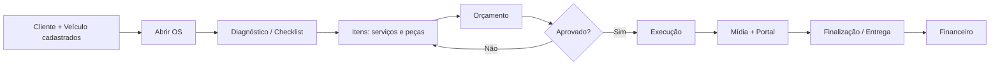
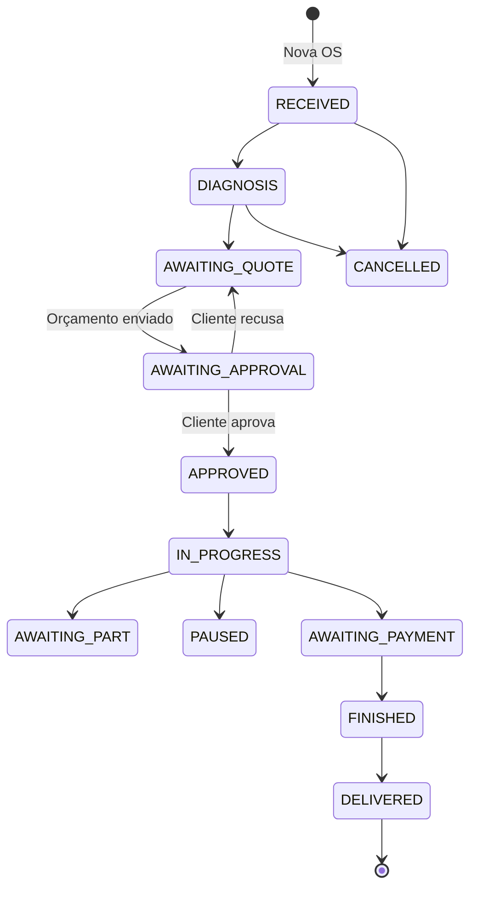

# Fluxo de atendimento — Scalibur ERP

Este manual descreve o **ciclo completo de atendimento** na oficina: desde o cadastro prévio até a entrega do veículo, incluindo diagnóstico, orçamento, aprovação pelo cliente, execução, mídia e portal.

---

## 1. Visão geral

O atendimento no Scalibur gira em torno da **Ordem de Serviço (OS)**. Cada OS está ligada a um **veículo**, que por sua vez pertence a um **cliente**.



**Pré-requisito:** cliente e veículo já cadastrados (ver [FLUXO-CADASTRO-CLIENTE-VEICULO.md](./FLUXO-CADASTRO-CLIENTE-VEICULO.md)).

---

## 2. Etapas no ERP (equipe)

### 2.1 Abrir a Ordem de Serviço

1. Acesse **Ordem de Serviço** no menu.
2. Clique em **Nova OS**.
3. Preencha:
   - **Veículo** (placa / cliente)
   - **Status inicial** — normalmente **Recebido**
   - **Relato do cliente** (reclamação, sintomas)
   - **Previsão de entrega** (opcional)
4. Confirme — o sistema abre a tela de detalhe da OS com número sequencial (ex.: OS #1001).

Ao criar a OS, o sistema já gera automaticamente:

- **Checklist padrão** do veículo (itens de inspeção)
- **Primeiro registro na timeline** (histórico de status)

---

### 2.2 Recepção e diagnóstico

Na tela da OS, use as abas:

| Aba | O que fazer |
|-----|-------------|
| **Dados** | Atualizar status, previsão, relato, diagnóstico, observações visíveis ao cliente |
| **Checklist** | Marcar cada item: OK, Atenção, Avariado ou N/A |
| **Timeline** | Acompanhar mudanças de status (automático ao alterar status) |

**Status recomendados nesta fase:**

| Status no sistema | Significado |
|-------------------|-------------|
| Recebido | Veículo acabou de chegar |
| Em diagnóstico | Mecânico analisando o problema |
| Aguardando orçamento | Diagnóstico feito; falta montar valores |

Altere o status em **Dados → Status**. Cada mudança fica registrada na **Timeline**.

---

### 2.3 Serviços e peças (aba Itens)

1. Abra a aba **Itens**.
2. Clique para **adicionar item**:
   - **Tipo:** Serviço ou Peça
   - **Descrição**, quantidade e **valor unitário**
   - Opcional: vincular **produto do estoque** ou item do **catálogo de serviços**
3. O **total da OS** é recalculado automaticamente com base nos itens.

> **Dica:** peças cadastradas no estoque podem gerar movimentação de saída quando integradas à OS (ver manual de produtos).

---

### 2.4 Orçamento e aprovação

O orçamento pode nascer de duas formas:

1. **Automática:** ao sincronizar itens da OS, o sistema cria/atualiza orçamento **Pendente** quando há valor nos itens.
2. **Manual:** menu **Orçamentos → Novo orçamento**, vinculando à OS.

**Status do orçamento:**

| Status | Significado |
|--------|-------------|
| Rascunho | Ainda em elaboração (não visível ao cliente) |
| Pendente | Aguardando resposta do cliente |
| Aprovado | Cliente aceitou |
| Recusado | Cliente recusou |
| Expirado | Prazo de validade vencido |

**Na OS (aba Orçamentos):**

- Visualize orçamentos vinculados
- Gere **link público** para o cliente aprovar/recusar sem login
- Use **Link portal** no topo da OS para acesso geral do cliente ao veículo

**Fluxo típico de status da OS após orçamento:**

```
Aguardando orçamento → Aguardando aprovação → Aprovado → Em execução
```

Quando o cliente **aprova** (portal ou link):

- Orçamento muda para **Aprovado**
- OS pode ir para **Aprovado** ou **Em execução**
- A equipe recebe **notificação** no ERP (polling)

Quando o cliente **recusa**:

- Orçamento fica **Recusado**
- OS volta para **Aguardando orçamento** para revisão

---

### 2.5 Execução do serviço

Atualize o status conforme o andamento:

| Status | Quando usar |
|--------|-------------|
| Em execução | Serviço em andamento na oficina |
| Aguardando peça | Parado por falta de material |
| Pausado | Interrupção temporária |
| Aguardando pagamento | Serviço pronto; falta receber |
| Finalizado | Serviço concluído tecnicamente |
| Entregue | Veículo devolvido ao cliente |
| Cancelado | OS encerrada sem conclusão |

---

### 2.6 Mídia (fotos e vídeos)

1. Aba **Mídia** na OS.
2. **Enviar mídia** — fotos ou vídeos do veículo, defeito ou reparo.
3. Arquivos vão para o **Supabase Storage** (nuvem) em produção.
4. Mídia enviada fica **visível ao cliente** no portal (marcada automaticamente).
5. Para remover anexo quebrado ou antigo: botão **lixeira** no canto da miniatura.

> **Importante:** fotos enviadas apenas no computador local (antes do deploy) **não aparecem** no portal — é preciso reenviar pela OS em produção.

---

### 2.7 Agenda (opcional)

Menu **Agenda**:

1. Agendar horário por **veículo**, data, duração e box/mecânico.
2. A partir do agendamento, é possível **gerar OS** com um clique.
3. Status do agendamento: Agendado, Confirmado, Em andamento, Concluído, Cancelado, Não compareceu.

---

## 3. Portal do cliente

O cliente acessa em URL separada (ex.: `portal.seudominio.com` ou app Vercel do portal).

### 3.1 Login

- **CPF** (mesmo cadastro do cliente no ERP)
- **Placa** do veículo (sem formatação especial; o sistema normaliza)

### 3.2 O que o cliente vê

- Status da OS e linha do tempo
- Orçamentos **pendentes** — botões **Aprovar** / **Recusar**
- **Fotos e vídeos** liberados pela oficina
- Botão **WhatsApp** (se telefone cadastrado)
- Link mágico `/acesso/{token}` — enviado pela oficina pelo botão **Link portal** na OS

### 3.3 Aprovação pelo portal

1. Cliente entra no portal.
2. Vê orçamento com linhas e valores.
3. Aprova ou recusa.
4. ERP atualiza status em até ~20 segundos (notificação por polling).

---

## 4. Diagrama de status da OS (referência)



---

## 5. Checklist operacional (resumo)

| # | Ação | Onde no ERP |
|---|------|-------------|
| 1 | Cliente e veículo cadastrados | Clientes / Veículos |
| 2 | Abrir OS | Ordem de Serviço → Nova OS |
| 3 | Preencher checklist e diagnóstico | OS → Checklist / Dados |
| 4 | Lançar serviços e peças | OS → Itens |
| 5 | Enviar orçamento / aguardar aprovação | OS → Orçamentos ou Portal |
| 6 | Registrar fotos do serviço | OS → Mídia |
| 7 | Executar e atualizar status | OS → Dados |
| 8 | Finalizar e entregar | Status Finalizado → Entregue |
| 9 | Gerar recebível | OS → **Gerar recebível** ou Financeiro |

---

## 6. Problemas comuns

| Situação | Causa provável | Solução |
|----------|----------------|---------|
| Cliente não entra no portal | CPF ou placa diferente do cadastro | Conferir documento e placa no ERP |
| Foto não aparece no portal | Arquivo só existia no PC local | Reenviar mídia pela OS em produção |
| Orçamento não sincroniza | OS sem itens com valor | Adicionar itens na aba Itens |
| Cliente não recebe notificação instantânea | Sistema usa polling (~20s) | Aguardar ou atualizar dashboard |

---

## 7. Próximo passo

Após **Entregue** e serviço faturado, siga o [FLUXO-FINANCEIRO.md](./FLUXO-FINANCEIRO.md) para contas a receber e caixa.
