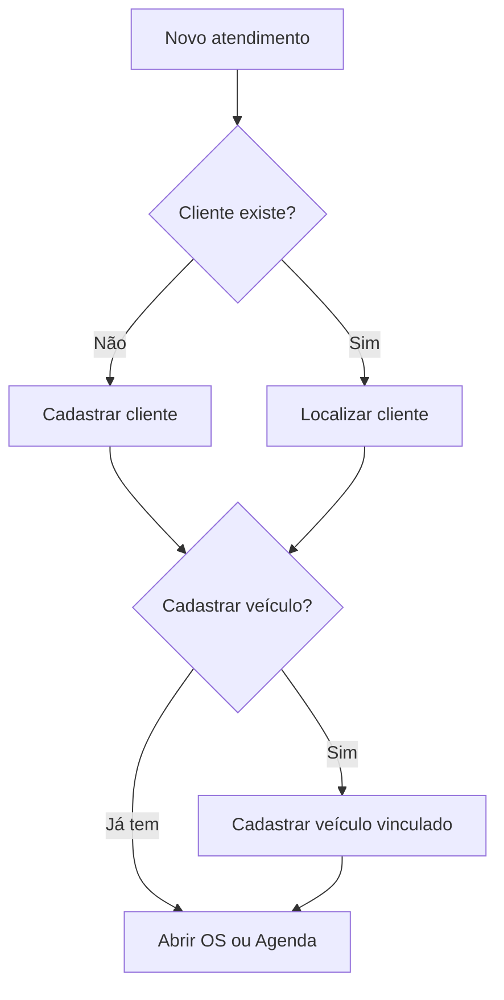

# Fluxo de cadastro — Cliente e Veículo

Manual para cadastrar **clientes** (pessoas ou empresas) e **veículos** vinculados no Scalibur ERP. Sem esses cadastros não é possível abrir Ordem de Serviço nem usar o portal do cliente.

---

## 1. Visão geral

**Regra de ouro:** todo veículo pertence a **um cliente**. A placa é **única por oficina** (não pode repetir).

---

## 2. Cadastro de cliente

### 2.1 Onde acessar

Menu **Clientes** → botão **Novo cliente** (ou clique na linha para editar).

Tela de detalhe: **Clientes → [nome]** — abas Visão, Veículos, OS, Orçamentos, Contatos, Timeline.

### 2.2 Campos principais

| Campo | Obrigatório | Observação |
|-------|-------------|------------|
| Nome | Sim | Nome completo ou razão social |
| Tipo | Sim | PF (pessoa física) ou PJ |
| CPF/CNPJ | Recomendado | Usado no **login do portal** (CPF) |
| Telefone / WhatsApp | Recomendado | Botão WhatsApp no portal |
| E-mail | Opcional | Contato e comunicações |
| Endereço completo | Opcional | Rua, número, bairro, cidade, UF, CEP |
| Origem | Opcional | Indicação, Google, etc. |
| VIP / Bloqueado / Inadimplente | Opcional | Flags operacionais |
| Observações | Opcional | Notas internas |

### 2.3 Passo a passo — novo cliente

1. **Clientes** → **Novo cliente**.
2. Preencha **Nome** e **Tipo** (PF/PJ).
3. Informe **CPF ou CNPJ** (somente números; o sistema limpa pontuação).
4. Cadastre **WhatsApp** — facilita contato a partir do portal.
5. Complete endereço se necessário para nota ou entrega.
6. Salve.

### 2.4 Contatos adicionais (PJ ou família)

Na ficha do cliente → aba **Contatos**:

1. **Novo contato**
2. Nome, cargo/função, telefone, e-mail
3. Útil para empresas com frota ou quando o titular não é quem traz o carro

### 2.5 Edição e exclusão

- **Editar:** abra o cliente → ícone lápis ou drawer de edição
- **Excluir:** lista de clientes → exclusão lógica (soft delete); histórico de OS permanece no banco

### 2.6 O que o cliente vê no portal

O portal usa:

- **CPF** = campo `document` do cliente (apenas dígitos)
- **Placa** = veículo vinculado

Se o CPF no cadastro estiver errado ou vazio, o cliente **não consegue logar**.

---

## 3. Cadastro de veículo

### 3.1 Onde acessar

**Opção A — menu Veículos**

1. **Veículos** → **Novo veículo**
2. Selecione o **cliente proprietário**
3. Preencha placa e demais dados

**Opção B — pela ficha do cliente**

1. **Clientes** → abrir cliente → aba **Veículos**
2. Atalho para cadastrar ou abrir veículo

### 3.2 Campos principais

| Campo | Obrigatório | Observação |
|-------|-------------|------------|
| Cliente | Sim | Dono do veículo |
| Placa | Sim | Única na oficina; normalizada (ex.: ABC1D23) |
| Marca / Modelo | Recomendado | Identificação visual |
| Ano / Cor | Opcional | |
| Tipo | Opcional | Carro, Moto, Caminhão, Outro |
| Chassi / Renavam | Opcional | Documentação |
| Combustível | Opcional | |
| KM atual | Recomendado | Referência na OS |
| Observações | Opcional | |

### 3.3 Passo a passo — novo veículo

1. **Veículos** → **Novo veículo**.
2. Escolha o **cliente** na lista.
3. Digite a **placa** (com ou sem hífen).
4. Preencha marca, modelo, cor, KM.
5. Salve.

Se a placa já existir, o sistema exibe erro **"Placa já cadastrada"**.

### 3.4 Ficha do veículo

**Veículos → [placa]** — abas:

| Aba | Conteúdo |
|-----|----------|
| Visão | KPIs, gastos, última visita |
| Histórico | OS anteriores |
| Orçamentos | Orçamentos das OS deste veículo |
| Mídia | Fotos do veículo (bucket `vehicle-photos`) |
| Timeline | Eventos de status das OS |

---

## 4. Fluxo completo — primeiro atendimento

Exemplo prático: cliente **João Silva** chega com **Gol placa ABC1D23**.

| Passo | Ação | Menu |
|-------|------|------|
| 1 | Cadastrar João (CPF, WhatsApp) | Clientes → Novo |
| 2 | Cadastrar Gol ABC1D23 vinculado a João | Veículos → Novo |
| 3 | Abrir OS para esse veículo | Ordem de Serviço → Nova OS |
| 4 | (Opcional) Agendar retorno | Agenda |

---

## 5. Cliente recorrente — veículo novo

1. Localize o cliente em **Clientes** (busca por nome, CPF ou telefone).
2. Cadastre **novo veículo** vinculado ao mesmo cliente.
3. Abra OS normalmente.

Um cliente pode ter **vários veículos** (frota, família).

---

## 6. Cliente recorrente — mesmo veículo

1. **Veículos** → busque pela **placa**.
2. Abra a ficha → veja histórico de OS.
3. **Ordem de Serviço → Nova OS** → selecione o veículo.

Não é necessário recadastrar cliente nem veículo.

---

## 7. Integração com outros módulos

| Módulo | Como usa cliente/veículo |
|--------|---------------------------|
| Ordem de Serviço | OS sempre ligada a um veículo |
| Orçamentos | Herdam cliente via OS |
| Portal | Login CPF + placa |
| Financeiro | Recebíveis podem vincular ao cliente |
| Agenda | Agendamento por veículo |
| Relatórios | Filtros por cliente, placa, período |

---

## 8. Boas práticas

1. **Sempre cadastre CPF** de clientes PF — necessário para o portal.
2. **Padronize placa** — evite cadastros duplicados (ABC1234 vs ABC-1234; o sistema normaliza, mas cuidado com erros de digitação).
3. **WhatsApp correto** — usado no botão de contato do portal.
4. **KM na entrada** — registre na OS (campo KM) para histórico.
5. **Contatos extras** em clientes PJ — quem autoriza serviço nem sempre é o titular.

---

## 9. Erros comuns

| Erro | Solução |
|------|---------|
| Placa já cadastrada | Buscar veículo existente; não criar duplicata |
| Portal: CPF ou placa inválidos | Conferir CPF do cliente e placa exata no ERP |
| Cliente sem veículo na OS | Cadastrar veículo antes de abrir OS |
| Dois clientes para o mesmo carro | Manter um veículo = um proprietário; transferir se necessário |

---

## 10. Próximo passo

Com cliente e veículo cadastrados, siga o [FLUXO-ATENDIMENTO.md](./FLUXO-ATENDIMENTO.md) para abrir e conduzir a Ordem de Serviço.
