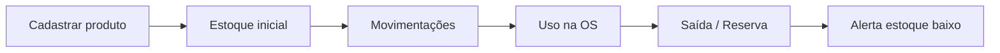
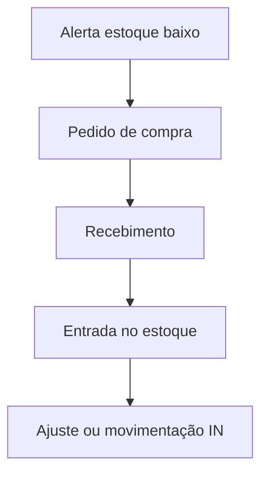

# Fluxo de cadastro — Produtos e estoque

Manual para cadastrar **peças e materiais** no estoque do OFICINA DO BETO ERP, controlar quantidades, estoque mínimo e uso nas Ordens de Serviço.

---

## 1. Visão geral



**Onde fica no menu:** **Estoque** (módulo de produtos/inventário).

Produtos são **por oficina** (multi-tenant): cada instalação vê apenas seu estoque.

---

## 2. Cadastro de produto

### 2.1 Novo produto

1. Menu **Estoque**.
2. Botão **Novo produto** (ou equivalente na barra de ações).
3. Preencha o formulário.
4. Salve.

### 2.2 Campos do cadastro

| Campo | Obrigatório | Descrição |
|-------|-------------|-----------|
| Nome | Sim | Ex.: "Filtro de óleo Mann W712/95" |
| SKU / Código | Recomendado | Código interno ou do fabricante |
| Categoria | Opcional | Ex.: Filtros, Freios, Lubrificantes |
| Marca | Opcional | Fabricante da peça |
| NCM | Opcional | Classificação fiscal (futuro NF-e) |
| Localização | Opcional | Prateleira, corredor, depósito |
| Estoque atual | Sim (padrão 0) | Quantidade em mãos na criação |
| Estoque mínimo | Sim (padrão 5) | Gera alerta no dashboard quando abaixo |
| Preço de custo | Recomendado | Quanto a oficina paga |
| Preço de venda | Recomendado | Quanto cobra do cliente na OS |

### 2.3 Exemplo de cadastro

| Campo | Valor exemplo |
|-------|----------------|
| Nome | Pastilha de freio dianteira Civic |
| SKU | PAST-Civic-D-001 |
| Categoria | Freios |
| Marca | Cobreq |
| Localização | A-12 |
| Estoque | 8 |
| Estoque mínimo | 2 |
| Custo | R$ 85,00 |
| Venda | R$ 140,00 |

---

## 3. Edição e exclusão

### Editar

1. Na lista de **Estoque**, clique no produto.
2. Altere nome, preços, estoque mínimo, localização, etc.
3. **Estoque atual** na edição: use **ajuste de estoque** (seção abaixo), não altere manualmente sem registrar movimento.

### Excluir

- Exclusão lógica (produto some da lista, histórico preservado).
- Confirme na caixa de diálogo.

---

## 4. Movimentações de estoque

Toda alteração de quantidade gera um **registro de movimentação** (auditoria).

### 4.1 Tipos de movimentação

| Tipo | Significado |
|------|-------------|
| Entrada | Compra, reposição, inventário positivo |
| Saída OS | Peça consumida em ordem de serviço |
| Reserva | Peça reservada para OS (não saiu fisicamente) |
| Liberação | Cancelamento de reserva |
| Ajuste | Correção manual (+ ou −) |
| Devolução | Retorno de peça à prateleira |

### 4.2 Ajuste manual de estoque

1. **Estoque** → localize o produto.
2. Ação **Ajustar estoque** (ou ícone equivalente).
3. Informe a **variação** (+10 entrou, −2 saiu) ou quantidade desejada conforme tela.
4. Confirme — movimentação tipo **Ajuste** é registrada.

Use ajuste para:

- Inventário físico (contagem de prateleira)
- Correção de erro de lançamento
- Entrada inicial após cadastro

### 4.3 Histórico de movimentações

Na página de **Estoque**, visualize a lista recente de movimentos:

- Produto, tipo, quantidade, saldo após
- OS vinculada (quando saída por serviço)
- Data/hora

---

## 5. Estoque baixo e alertas

O **Dashboard** exibe KPI **Peças em estoque baixo** quando:

```
estoque disponível ≤ estoque mínimo
```

(Estoque disponível = estoque − reservado.)

Filtro na listagem: **Somente estoque baixo** para reposição rápida.

---

## 6. Uso do produto na Ordem de Serviço

### 6.1 Fluxo recomendado

1. Cadastre a peça no **Estoque** com preço de venda.
2. Abra a **OS** → aba **Itens**.
3. Adicione item tipo **Peça**:
   - Selecione o **produto** do estoque (quando disponível na tela)
   - Ou digite descrição e valor manualmente
4. Quantidade × preço entra no total da OS.

### 6.2 Integração estoque ↔ OS

Quando a peça está vinculada ao produto cadastrado, o sistema pode registrar **movimentação de saída** ligada à OS (dependendo da operação configurada na API).

Consulte o histórico em **Estoque → Movimentações** para ver saídas com número da OS.

---

## 7. Catálogo de serviços (complementar)

Menu **Serviços** — cadastro de **mão de obra** e serviços padronizados (ex.: "Troca de óleo", "Alinhamento").

| Diferença | Produto (Estoque) | Serviço (Catálogo) |
|-----------|-------------------|---------------------|
| Controla quantidade | Sim | Não |
| Tipo na OS | Peça (PART) | Serviço (SERVICE) |
| Uso típico | Filtro, pastilha | Diagnóstico, mão de obra |

Na OS → Itens, você pode puxar do **catálogo de serviços** ou do **estoque de produtos**.

---

## 8. Compras (reposição)

Menu **Compras** — pedidos a fornecedores (módulo complementar).

Fluxo ideal de reposição:



Após receber mercadoria, registre **entrada** no estoque para refletir quantidade real.

---

## 9. Checklist — novo produto na oficina

| # | Passo |
|---|--------|
| 1 | Definir SKU interno padronizado |
| 2 | Cadastrar nome, categoria, localização |
| 3 | Informar custo e preço de venda |
| 4 | Lançar estoque inicial |
| 5 | Configurar estoque mínimo |
| 6 | Testar inclusão em uma OS de teste |
| 7 | Conferir movimentação no histórico |

---

## 10. Boas práticas

1. **SKU único** — evita duplicar o mesmo item com nomes diferentes.
2. **Localização física** — acelera busca na prateleira.
3. **Atualize preço de venda** quando custo subir — margem consistente na OS.
4. **Inventário periódico** — ajustes pequenos evitam divergência grande.
5. **NCM** — preencher se for emitir NF-e no futuro.

---

## 11. Problemas comuns

| Situação | Solução |
|----------|---------|
| Produto não aparece na OS | Verificar se não foi excluído; buscar pelo nome/SKU |
| Estoque negativo | Fazer ajuste positivo; revisar saídas duplicadas |
| Dashboard alerta falso | Revisar estoque mínimo (muito alto) |
| Preço zerado na OS | Cadastrar preço de venda no produto |

---

## 12. Próximo passo

Peças lançadas na OS entram no [FLUXO-ATENDIMENTO.md](./FLUXO-ATENDIMENTO.md). Valores faturados seguem para o [FLUXO-FINANCEIRO.md](./FLUXO-FINANCEIRO.md).
