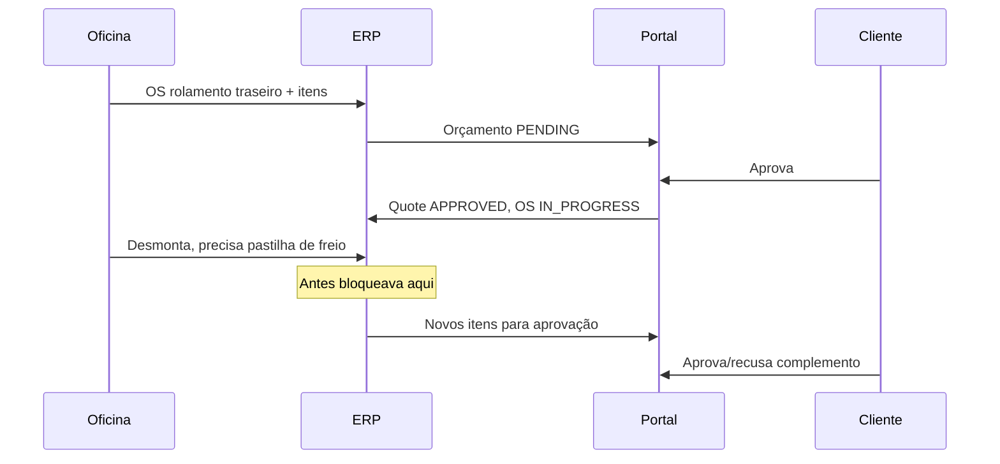
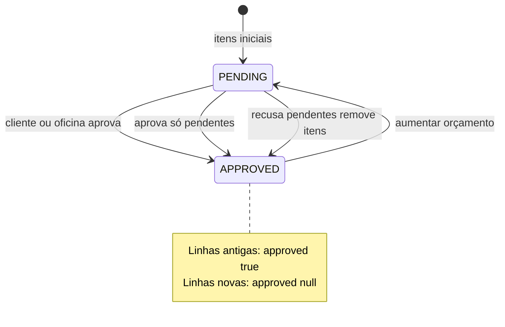

# Complemento de orçamento na mesma OS

Permite adicionar serviços/peças a uma OS já em andamento (orçamento aprovado), reabrir o **mesmo** orçamento só para os itens novos, e enviar ao cliente no portal — ou aprovar/recusar manualmente no ERP — **sem criar nova OS**.

---

## Contexto e problema

Fluxo desejado:

**O que já existia e ajudou:**

- Itens da OS são a fonte da verdade; linhas do orçamento espelham via [`quotes-sync.service.ts`](../../apps/api/src/quotes/quotes-sync.service.ts)
- Portal já suporta aprovação **por linha** ([`portal.service.ts`](../../apps/api/src/portal/portal.service.ts) + [`quote-lines.ts`](../../apps/portal/src/lib/quote-lines.ts))
- Aba **Orçamento** em [`ServiceOrderDetailPage.tsx`](../../app/src/pages/service-orders/ServiceOrderDetailPage.tsx) já tinha imprimir, link cliente, aprovar/recusar manual

**Bloqueios que existiam antes da implementação:**

| Bloqueio | Onde |
|----------|------|
| UI não permitia adicionar itens com orçamento aprovado | `canManageQuote = activeQuote.status !== "APPROVED"` em [`ServiceOrderDetailPage.tsx`](../../app/src/pages/service-orders/ServiceOrderDetailPage.tsx) (~367) |
| Sync apagava aprovações ao editar itens | `syncQuoteLines` fazia `deleteMany` + recria tudo com `approved: null` ([`quotes-sync.service.ts`](../../apps/api/src/quotes/quotes-sync.service.ts) ~30-45) |
| Sync ignorava OS em andamento | `syncForServiceOrder` só buscava quotes `PENDING`/`DRAFT`; se só existia `APPROVED`, criar novo PENDING mudava status da OS de forma confusa (~105-111) |
| Aprovação manual era tudo-ou-nada | `approveFromOffice` marcava **todas** as linhas como aprovadas ([`quotes.service.ts`](../../apps/api/src/quotes/quotes.service.ts) ~239-242) |
| Cliente não era avisado do complemento | Push `quote.sent` só ao gerar link; adicionar item após aprovação não notificava |

---

## Solução: reabrir o **mesmo** orçamento (complemento)

Manter **uma OS** e **um número de orçamento**. Itens já aprovados ficam com `approved: true`; itens novos entram com `approved: null` e disparam novo ciclo de aprovação.

A OS permanece `IN_PROGRESS` durante o complemento (oficina continua o serviço; só aguarda ok dos itens novos).

---

## 1. Backend — sync inteligente de linhas

**Arquivo:** [`apps/api/src/quotes/quotes-sync.service.ts`](../../apps/api/src/quotes/quotes-sync.service.ts)

Substituir o `deleteMany` + `createMany` por sync **upsert por `serviceOrderItemId`**:

- Linha existente: atualizar qty/preço/descrição, **preservar `approved`**
- Item novo na OS: criar linha com `approved: null`
- Item removido da OS: deletar linha correspondente
- Recalcular `quote.amount` = soma de **todas** as linhas (ou só aprovadas + pendentes, conforme regra de exibição)

Função auxiliar: `hasPendingLines(quoteId)` → existe linha com `approved === null`.

---

## 2. Backend — reabrir orçamento para complemento

**Endpoint:** `POST /quotes/:id/reopen-supplement`  
**Arquivos:** [`quotes.controller.ts`](../../apps/api/src/quotes/quotes.controller.ts), [`quotes.service.ts`](../../apps/api/src/quotes/quotes.service.ts)

Regras:

- Quote atual = `APPROVED`
- OS em status permitido: `IN_PROGRESS`, `APPROVED`, `AWAITING_PART` (não `FINISHED`/`DELIVERED`/`CANCELLED`)
- Ação: `quote.status = PENDING` (linhas antigas mantêm `approved: true`)
- **Não** alterar OS para `AWAITING_APPROVAL` — manter `IN_PROGRESS`
- Registrar em `serviceOrderStatusHistory` nota: "Complemento de orçamento solicitado"

**Gatilho automático:** em [`service-orders.service.ts`](../../apps/api/src/service-orders/service-orders.service.ts) `addItem` / `updateItem` / `removeItem`, se a OS tiver quote `APPROVED` e não houver `PENDING`, chamar `reopenForSupplement` antes do sync.

**Ajuste em `syncForServiceOrder`:** quando OS já está em execução e existe quote `APPROVED`, não criar segundo orçamento; delegar ao fluxo de complemento.

---

## 3. Backend — aprovação e recusa do complemento

### Portal ([`portal.service.ts`](../../apps/api/src/portal/portal.service.ts))

Ajustar `applyLineApprovals` e `approveQuote`:

- `allApproved` = **todas** as linhas com `approved === true` (inclui as já aprovadas antes + novas)
- Payload do cliente envia **apenas linhas pendentes** (`approved === null`)
- Linhas já `approved: true` ignoradas no payload (não podem ser desmarcadas)

Ao aprovar complemento:

- Quote volta `APPROVED`
- OS permanece `IN_PROGRESS`
- `totalAmount` da OS = soma das linhas aprovadas

Ao recusar **somente itens novos** (nenhuma linha pendente aprovada):

- Remover da OS os `serviceOrderItem` das linhas recusadas (`approved: false`)
- Se ainda existem linhas aprovadas → quote `APPROVED`, sync linhas
- Se todas recusadas (cenário raro no complemento) → manter comportamento atual de rejeição total

### ERP manual ([`quotes.service.ts`](../../apps/api/src/quotes/quotes.service.ts))

Evoluir `approveFromOffice`:

- **"Aprovar itens novos"**: aprovar só linhas com `approved === null`
- Se todas as linhas ficarem aprovadas → quote `APPROVED`, OS `IN_PROGRESS`

Evoluir `rejectFromOffice` no contexto de complemento:

- Recusar só pendentes e remover itens correspondentes da OS (não derrubar OS inteira para `AWAITING_QUOTE`)

### Link e notificação

[`createShareLink`](../../apps/api/src/quotes/quotes.service.ts):

- Continuar permitindo `PENDING` (inclui complemento)
- Título/body diferenciado: "Itens adicionais no orçamento da OS #X"
- Evento `quote.sent` (ou `quote.supplement`) com push para o cliente

---

## 4. ERP — aba Orçamento da OS

**Arquivo:** [`ServiceOrderDetailPage.tsx`](../../app/src/pages/service-orders/ServiceOrderDetailPage.tsx)

### Estado visual

Detectar complemento: `activeQuote.status === "PENDING"` **e** existe linha com `approved === true`.

| Situação | UI |
|----------|-----|
| Orçamento aprovado, sem pendências | Botão primário **"Aumentar orçamento"** |
| Complemento aberto (PENDING + linhas mistas) | Banner: "Aguardando aprovação de X item(ns) novo(s)" |
| Itens na tabela | Coluna **Status** (Aprovado / Aguardando / Recusado) usando [`lineApprovalLabel`](../../app/src/lib/service-order-status.ts) |

### Ações disponíveis no complemento

- **Adicionar** / editar / remover → só itens com `approved !== true` (itens já aprovados ficam somente leitura)
- **Enviar ao cliente** → `POST /quotes/:id/share-link` (já existe)
- **Aprovar itens novos** → `PATCH /quotes/:id/approve` com payload parcial (client [`api.ts`](../../app/src/lib/api.ts))
- **Recusar itens novos** → reject parcial ou endpoint dedicado

### `getActiveQuote`

Prioridade: `PENDING` (complemento) → `DRAFT` → último `APPROVED` — garantir que complemento PENDING apareça antes do histórico aprovado.

Ações equivalentes em [`QuoteDetailPage.tsx`](../../app/src/pages/quotes/QuoteDetailPage.tsx) para consistência.

---

## 5. Portal do cliente

**Arquivos:** [`QuoteDetailContent.tsx`](../../apps/portal/src/components/portal/QuoteDetailContent.tsx), [`quote-lines.ts`](../../apps/portal/src/lib/quote-lines.ts), [`PortalHomePage.tsx`](../../apps/portal/src/pages/PortalHomePage.tsx)

- Separar visualmente:
  - **Já aprovados** — lista somente leitura, sem checkbox
  - **Novos itens** — checkboxes + total só dos pendentes
- `initialLineChoices` / `buildApprovePayload` — apenas linhas `approved === null`
- Card na home: "Novos itens no orçamento" quando complemento PENDING
- Página pública [`PublicQuotePage.tsx`](../../apps/portal/src/pages/PublicQuotePage.tsx): mesma lógica

---

## 6. Modelo de dados

**Sem migration obrigatória** — usar `QuoteLine.approved` existente:

| `approved` | Significado |
|------------|-------------|
| `true` | Aprovado (original ou complemento) |
| `null` | Aguardando aprovação |
| `false` | Recusado (item deve sair da OS) |

Opcional (fase 2): campo `QuoteLine.addedAt` ou flag `isSupplement` para auditoria — não bloqueia o MVP.

---

## 7. Cenário de teste (rolamento + pastilha)

1. Criar OS com serviço "Troca rolamento traseiro" + peça → orçamento PENDING
2. Cliente aprova no portal → quote APPROVED, OS IN_PROGRESS
3. Na aba Orçamento, clicar **Aumentar orçamento**
4. Adicionar peça "Pastilha de freio" + serviço "Troca pastilha"
5. Ver linhas: rolamento **Aprovado**, pastilha **Aguardando**
6. **Enviar ao cliente** → push + link
7. Cliente aprova só pastilha no portal → quote APPROVED, OS IN_PROGRESS, total atualizado
8. Alternativa: oficina clica **Aprovar itens novos** manualmente (telefone/WhatsApp)

---

## 8. Escopo fora desta entrega

- Não criar segunda OS para o mesmo veículo (objetivo explícito)
- Não alterar fluxo financeiro/comissões além do `totalAmount` já existente
- Não mudar enum `ServiceOrderStatus` (usar `IN_PROGRESS` + quote PENDING)

---

## Ordem de implementação

1. Sync preservando `approved` + `reopen-supplement` (API)
2. Ajustes approve/reject portal e office (API)
3. UI aba Orçamento no ERP (botão + tabela + ações)
4. UI portal (seções + payload parcial)
5. Notificação push do complemento
6. Testes manuais do fluxo rolamento → pastilha
