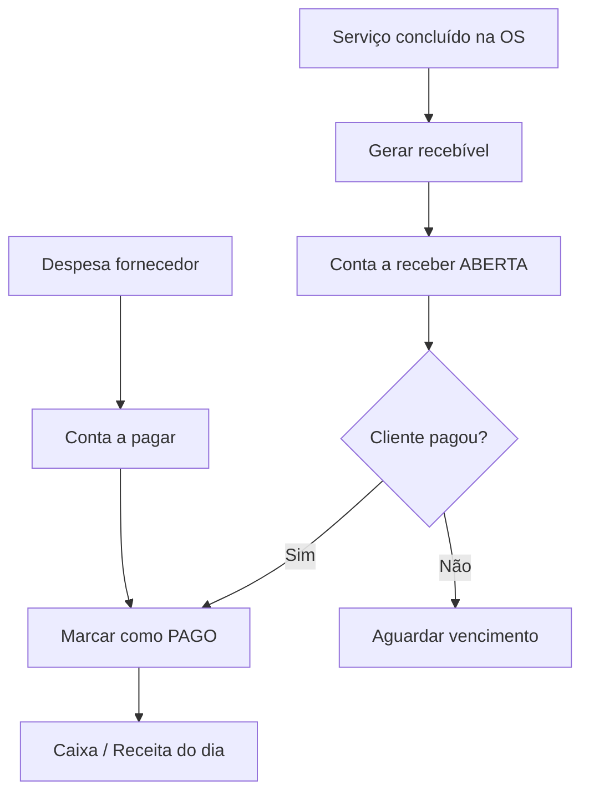
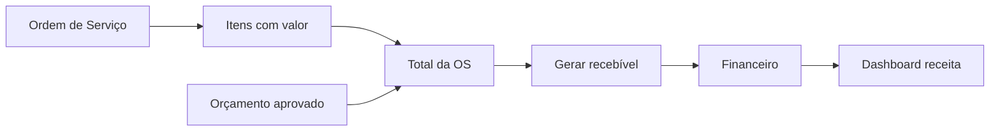

# Fluxo financeiro — WTEC Motors ERP

Manual de **contas a pagar e receber**, **caixa da oficina**, faturamento a partir da OS e acompanhamento de receitas no dashboard.

---

## 1. Visão geral



**Onde acessar:** menu **Financeiro** — abas **Lançamentos** e **Caixa**.

---

## 2. Conceitos

### 2.1 Tipos de lançamento

| Tipo | Significado | Exemplo |
|------|-------------|---------|
| **A receber** (RECEIVABLE) | Dinheiro que a oficina vai receber | OS #1001 — R$ 850,00 |
| **A pagar** (PAYABLE) | Dinheiro que a oficina deve pagar | Fornecedor de peças |

### 2.2 Status

| Status | Significado |
|--------|-------------|
| **Aberto** (OPEN) | Aguardando pagamento |
| **Pago** (PAID) | Quitado |
| **Cancelado** | Anulado (quando aplicável) |

### 2.3 Formas de pagamento

Dinheiro, PIX, Cartão, Boleto, Transferência, Outro.

Usadas ao **marcar como pago** e no registro de caixa.

---

## 3. Contas a receber (clientes)

### 3.1 Origem automática — pela OS

Quando a OS está com **valor total > 0**:

1. Abra a **Ordem de Serviço**.
2. Clique **Gerar recebível** (botão verde no topo).
3. O sistema cria lançamento:
   - Descrição: `OS #1001 — recebível de serviços`
   - Valor = total da OS
   - Cliente = dono do veículo
   - Vencimento = data atual (editável depois)
4. Você é redirecionado ao **Financeiro**.

> Se já existir recebível aberto para a mesma OS, o sistema **não duplica** — retorna o existente.

### 3.2 Lançamento manual

1. **Financeiro** → aba **Lançamentos**.
2. **Nova conta a receber**.
3. Preencha:
   - Descrição
   - Valor
   - Data de vencimento
   - Parcelas (opcional — ver seção 4)
4. Salve.

### 3.3 Receber pagamento (baixa)

1. Localize o lançamento **Aberto**.
2. Ação **Marcar como pago** / **Receber**.
3. Informe:
   - **Forma de pagamento** (PIX, dinheiro, cartão…)
   - **Data do pagamento**
   - **Registrar no caixa** — marque se pagamento em **dinheiro** e caixa estiver aberto
4. Confirme.

**Efeitos ao marcar recebível como pago:**

- Status → **Pago**
- Se vinculado à OS, alimenta **receita do dia** no dashboard
- Se dinheiro + caixa aberto + opção marcada → movimento **Entrada** no caixa
- Registro de **auditoria** financeira

---

## 4. Parcelamento

Ao criar lançamento manual, informe **número de parcelas** > 1:

1. Sistema cria um lançamento **pai** (valor total).
2. Cria **parcelas filhas** com vencimentos mensais.
3. Cada parcela pode ser baixada individualmente.

Exemplo: R$ 900,00 em 3x → três parcelas de R$ 300,00 com vencimentos em meses consecutivos.

---

## 5. Contas a pagar (fornecedores)

1. **Financeiro** → **Nova conta a pagar**.
2. Descrição (ex.: "NF Fornecedor X — peças").
3. Valor e vencimento.
4. Ao pagar fornecedor → **Marcar como pago** com forma de pagamento.

Despesas pagas entram no **fluxo de caixa** para análise de entradas × saídas.

---

## 6. Caixa da oficina

Aba **Caixa** dentro de **Financeiro**.

### 6.1 Abrir caixa

1. Informe **saldo inicial** (troco em espécie).
2. Confirme **Abrir caixa**.

Só pode haver **um caixa aberto** por vez.

### 6.2 Durante o dia

| Operação | Tipo | Uso |
|----------|------|-----|
| Suprimento | Entrada de dinheiro | Reforço de troco |
| Sangria / Retirada | Saída | Levar dinheiro ao banco, pagamento pequeno |
| Pagamento recebido | Automático | Ao baixar recebível em dinheiro com "Registrar no caixa" |

### 6.3 Fechar caixa

1. Revise movimentos do dia.
2. Informe **saldo de fechamento** (contagem física).
3. **Fechar caixa** — sessão encerrada; saldo esperado vs. informado fica registrado.

### 6.4 Saldo do caixa

```
Saldo = Abertura + Suprimentos + Recebimentos em dinheiro − Sangrias − Pagamentos em dinheiro
```

---

## 7. Integração com a OS e orçamento



| Etapa | Módulo |
|-------|--------|
| Valor definido | OS → Itens |
| Cliente aprova | Portal / Orçamentos |
| Serviço entregue | OS → Entregue |
| Cobrança | OS → Gerar recebível |
| Recebimento | Financeiro → Pago |

---

## 8. Dashboard e relatórios

### Dashboard (tela inicial)

- **Receita do dia** — recebíveis pagos hoje
- **Receita mensal** — acumulado do mês
- **Ticket médio** — média das OS faturadas
- KPIs atualizados conforme baixas financeiras

### Relatórios

Menu **Relatórios** — visões consolidadas (exportação conforme tela).

### Fluxo de caixa histórico

API calcula entradas e saídas **pagas** nos últimos meses — base para gráficos de forma de pagamento e tendência.

---

## 9. Fluxo completo — exemplo

**Cenário:** OS #1020 finalizada — total R$ 1.200,00. Cliente paga metade no PIX e metade no cartão (dois recebimentos).

| Passo | Ação |
|-------|------|
| 1 | OS em status **Entregue** |
| 2 | **Gerar recebível** R$ 1.200,00 |
| 3 | Cliente paga R$ 600 PIX → baixar R$ 600 (parcial)* ou criar dois lançamentos de R$ 600 |
| 4 | Cliente paga R$ 600 cartão → baixar restante |
| 5 | Conferir **Dashboard** — receita do dia |

\* *Para split exato, use dois lançamentos manuais ou parcelas conforme política da oficina.*

---

## 10. Checklist diário do caixa

| # | Tarefa |
|---|--------|
| 1 | Abrir caixa com troco |
| 2 | Baixar recebíveis do dia (PIX, cartão, dinheiro) |
| 3 | Lançar contas a pagar vencidas |
| 4 | Registrar sangrias/suprimentos |
| 5 | Fechar caixa e conferir saldo físico |
| 6 | Revisar dashboard de receita |

---

## 11. Boas práticas

1. **Gere recebível** só com OS conferida e valor final correto.
2. **Baixe no dia** — dashboard reflete realidade.
3. **Vincule à OS** — rastreabilidade cliente → serviço → pagamento.
4. **Caixa aberto** durante expediente — recebimentos em dinheiro ficam rastreados.
5. **Parcelamento** — use para acordos formais; registre cada parcela paga.

---

## 12. Problemas comuns

| Situação | Solução |
|----------|---------|
| Botão "Gerar recebível" não aparece | OS com total zero — adicionar itens |
| Recebível duplicado | Sistema evita duplicata aberta; use o existente |
| Caixa não registra entrada | Marcar "Registrar no caixa" + pagamento em dinheiro + caixa aberto |
| Dashboard zerado | Confirmar que lançamentos estão **Pagos**, não apenas Abertos |
| Não consigo abrir caixa | Já existe sessão aberta — fechar anterior |

---

## 13. Documentos relacionados

- [FLUXO-ATENDIMENTO.md](./FLUXO-ATENDIMENTO.md) — OS até entrega
- [FLUXO-CADASTRO-CLIENTE-VEICULO.md](./FLUXO-CADASTRO-CLIENTE-VEICULO.md) — cliente vinculado ao recebível
- [FLUXO-CADASTRO-PRODUTO.md](./FLUXO-CADASTRO-PRODUTO.md) — custo de peças na OS
